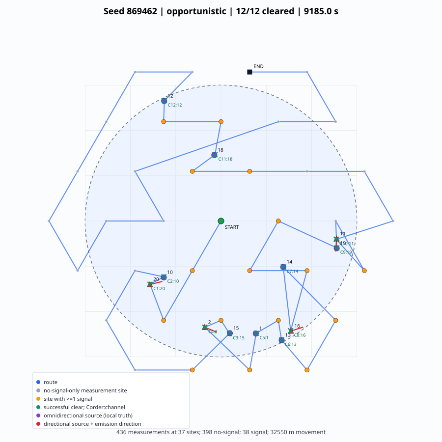
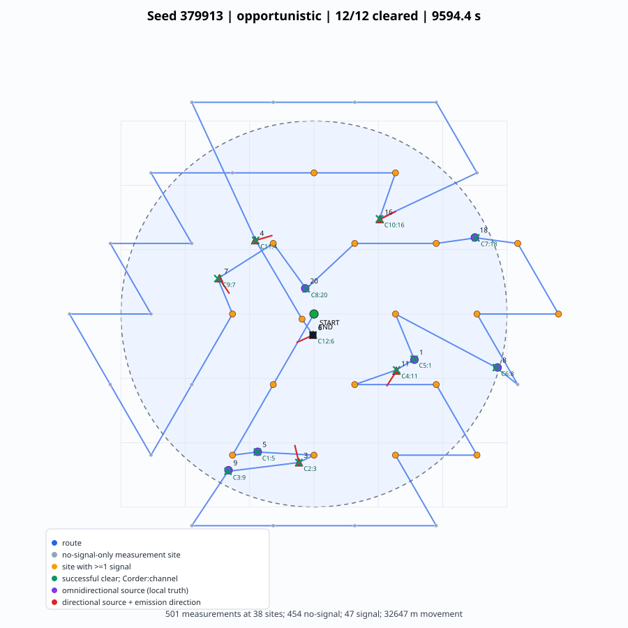
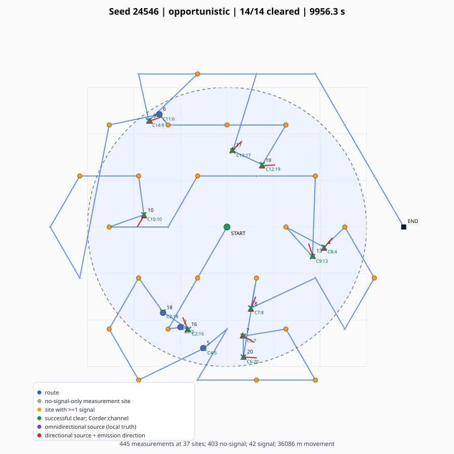

# 三次随机案例路径图

案例由固定随机选择种子 `2026091103` 抽取，便于复现。

## Seed 869462

- 干扰源：12（定向 4）
- 清除：12/12
- 总虚拟时间：9185.02 s
- 移动距离：32550.09 m
- 测量：436，无信号：398，不同测量位置：37
- 首次清除：770.47 s

## Seed 379913

- 干扰源：12（定向 6）
- 清除：12/12
- 总虚拟时间：9594.36 s
- 移动距离：32646.81 m
- 测量：501，无信号：454，不同测量位置：38
- 首次清除：714.69 s

## Seed 24546

- 干扰源：14（定向 10）
- 清除：14/14
- 总虚拟时间：9956.30 s
- 移动距离：36086.48 m
- 测量：445，无信号：403，不同测量位置：37
- 首次清除：701.54 s

