# 【论文标题占位】有界误差下的主动定位与多源鲁棒搜索

## 摘要

针对圆形区域内未知多干扰源的发现、定位与清除问题，本文建立一套由几何定位、主动感知、保证型搜索和定向鲁棒扩展组成的统一模型。首先，将示向误差视为确定性的有界误差，以两个半平面构成单次观测的前向楔形，并通过多站交会及目标圆精确裁剪得到目标的硬可行区域。进一步以区域直径刻画定位尺度，同时指出直径不能直接替代覆盖圆直径：构造实例中区域直径为 \(43.348530\rm\,m\)，最小覆盖圆直径却为 \(46.196234\rm\,m\)。其次，在第一次观测形成的可行区域上设计第二检测点，比较 GDOP Mean、Geometry、FIM E-optimal 与 Random 四种策略；10,000 个有效模拟场景中，GDOP Mean 的平均定位直径为 \(52.38\rm\,m\)，综合表现最好。随后，将定位模块嵌入未知多源任务，提出“确定性保证层—动态时间优化层”结构：以七点覆盖保证全向源发现，以 5 m 硬网格维护分频道可行域，以最小包围圆签发安全清除证书，再通过开放路线、完成代价预演、共享停靠和有限光学试探降低总时间。该策略在 100 场本地测试中完成 100/100 场并清除 1291/1291 个源，总时间折合 \(256.01\rm\,s/源\)。最后，针对定向源使负观测失去直接排除意义的问题，改用 25 点双环发现结构，并以“50 m 认证圆 + 半径 36 m 的十点光学环”建立确定性局部收尾。五组共 1000 个本地验证案例全部完成；其中混合 300 例的平均完成时间由 \(6641.99\rm\,s\) 降至 \(6377.34\rm\,s\)，改善 \(3.98\%\)。受控实验进一步表明，定向比例是主要时间敏感因素，且与源数存在明显交互。本文严格区分几何证明、本地模拟、官方模拟器演练与正式测试四类证据，为安全保证与时间效率的统一提供了可复现方案。

**关键词：** 集员定位；纯方位定位；主动感知；滚动时域规划；鲁棒搜索

# 1 问题分析与总体建模框架

## 1.1 问题背景与核心困难

机器人需在半径 \(1800\rm\,m\) 的圆形区域内处理分布于不同频道的无线电干扰源。干扰源数量、位置与接收半径均未知，示向读数存在 \(\pm1^\circ\) 的硬误差；移动、检测、切换频道、光学定位和激光清除又具有不同时间成本。问题四进一步允许干扰源仅向未知的 \(180^\circ\) 半平面发射，使“未收到信号”的含义发生根本变化。

因此，问题的难点并非单次方位线交会，而是四类不确定性和决策的耦合：一是如何在无概率分布承诺的条件下保持位置真值不被误删；二是如何选择新观测位置，使可行域有效收缩；三是如何把发现、定位、频道调度、清除和终止合并为动态策略；四是如何在定向可见性下重建发现与安全收尾保证。全文遵循

\[
\boxed{
\text{有界示向误差下的几何定位}
\rightarrow
\text{主动选择高价值观测}
\rightarrow
\text{全向源的保证型动态搜索}
\rightarrow
\text{定向可见性下的鲁棒扩展}}
\]

这一主线。

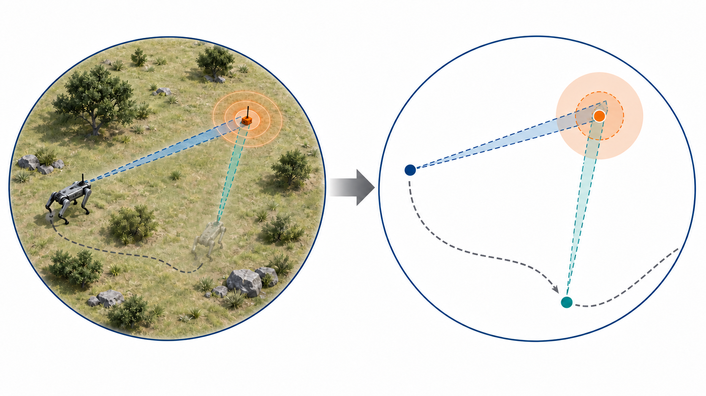

## 1.2 四个问题的递进关系

问题一回答“当前知道目标在哪里”：由有界示向构造硬可行域并计算其几何尺度。问题二回答“下一次应在哪里测”：以问题一的可行域为状态，主动选择能够形成良好交会几何的新检测点。问题三回答“如何保证全部发现、定位和清除且尽量快”：将局部测点选择嵌入多频道状态机与全局路线。问题四则放松问题三的全向可见假设，重新设计对负观测的解释、发现覆盖和局部清除结构。

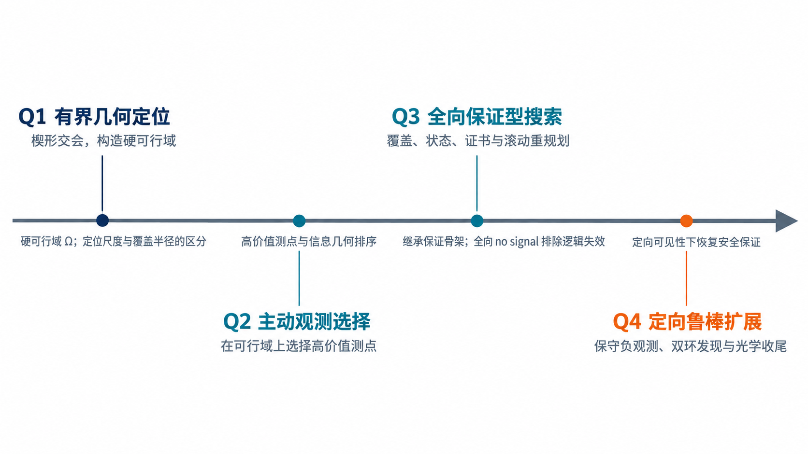

## 1.3 文献依据与本文定位

有界不确定性感知可将每次测量表示为凸集合，并以集合交维护所有相容状态，为本文的硬可行域建模提供了直接思想来源[1-2]。纯方位定位的 FIM 与可观测性研究表明，近平行方位会造成信息退化，而近正交观测通常具有更好的局部几何[3-5]；本文仅将这类概率信息指标用作候选排序代理，最终评价仍回到 \(\pm1^\circ\) 硬误差集合。多目标移动搜索研究提出同时维护已发现与尚未发现目标状态、并滚动选择控制动作的框架[6-8]，为问题三的集合管理和动态决策提供了方法依据。

上述文献并未直接覆盖本题的有限接收半径、频道切换、光学清除、定向发射和严格终止条件。因而本文吸收的是集合求交、信息几何和滚动规划思想，而不是将文献中的高斯噪声、传感模型或概率先验误作题设事实。

# 2 统一建模基础

## 2.1 基本假设、参数与时间模型

搜索区域内共有 20 个可检测频道，实际干扰源数量为 10—16 个；每个干扰源占用互不相同的频道，因而同一频道至多对应一个静止源。机器人位置和动作结果由题目接口给出，策略只能依据自身位置、检测反馈与历史动作更新状态，不读取干扰源的真实位置、接收半径、类型或方向。

示向误差采用未知但有界的确定性解释。特别地，同一频道在同一位置重复检测得到相同的固定误差，而不是从某个分布中独立重采样。因此，原地重复测量并取平均不能把误差界缩小为 \(1/\sqrt n\)，真正的新信息必须来自不同位置形成的几何交会。后文若使用概率样本或软后验，均只用于候选排序，不改变这一硬误差假设。

| 符号或参数 | 含义 | 数值 |
|---|---|---:|
| \(R_0\) | 目标圆半径 | \(1800\rm\,m\) |
| \(R\) | 干扰源接收半径 | \(1000\text{--}1500\rm\,m\) |
| \(\varepsilon\) | 示向误差上界 | \(1^\circ\) |
| \(v\) | 机器人速度 | \(5\rm\,m/s\) |
| \(t_m\) | 单次无线检测时间 | \(5\rm\,s\) |
| \(t_s\) | 切换频道时间 | \(1\rm\,s\) |
| \(t_o\) | 单次光学定位时间 | \(3\rm\,s\) |
| \(t_c\) | 激光清除时间 | \(2\rm\,s\) |
| \(r_n\) | 近距离阈值 | \(5\rm\,m\) |
| \(r_c\) | 光学清除距离 | \(20\rm\,m\) |

以接口累计的虚拟时间作为统一指标：

\[
T=T_{\rm move}+T_{\rm measure}+T_{\rm switch}
+T_{\rm optical}+T_{\rm clear}.
\]

其中 \(T_{\rm move}\) 由实际移动距离除以速度得到。程序在计算机上的墙钟运行时间不计入比赛虚拟时间。

## 2.2 有界误差观测与三类反馈

在检测点 \(S_i=(x_i,y_i)\) 得到示向读数 \(\hat\theta_i\) 时，真实方位满足

\[
\theta_i\in[\hat\theta_i-\varepsilon,\hat\theta_i+\varepsilon],
\qquad \varepsilon=1^\circ.
\]

因此一次正常示向对应一个前向楔形集合。三类反馈的统一解释如下。

| 观测 | 基本含义 | 安全使用方式 |
|---|---|---|
| `direction` | 获得有界示向 | 与已有硬可行域求交 |
| `near` | 源距当前位置不超过 \(5\rm\,m\) | 立即进入光学清除 |
| `no signal` | 当前条件下未接收 | 依源类型与可见性解释 |

对问题三的全向源，若候选位置距检测点不超过必接收半径 \(1000\rm\,m\)，则 `no signal` 可确定性排除该候选位置；对问题四的定向源，机器人可能位于发射半平面之外，同一结论不再成立。

## 2.3 计时口径与证据层级

本文所有策略性能均采用前述时间分解式的虚拟时间口径。移动时间由路程和 \(5\rm\,m/s\) 的速度换算，检测、切频、光学和激光动作按接口规定累加；算法在计算机上的墙钟时间只反映实现效率和硬件环境，不与比赛成绩混合。

后文结论分为四个证据层级。半平面交会、七点覆盖、最小包围圆清除条件、双环发现覆盖和十点光学环上界属于数学或几何证明；固定种子的大样本与受控实验属于本地模拟；官方模拟器演练只用于检查接口和策略波动；三次正式测试则按原始日志如实报告。低层级证据不能替代高层级结论：本地零失败不能证明连续空间中失败概率为零，正式三局也不能代表隐藏案例分布。

# 3 问题一：有界误差下的交会定位

## 3.1 示向约束与交会定位区域

令

\[
u(\theta)=(\cos\theta,\sin\theta),
\]

并以二维叉积 \(a\times b=a_xb_y-a_yb_x\) 表示左右侧关系。目标位置 \(X\) 与第 \(i\) 次读数相容，当且仅当

\[
u(\hat\theta_i-\varepsilon)\times(X-S_i)\ge 0,
\]

\[
u(\hat\theta_i+\varepsilon)\times(X-S_i)\le 0.
\]

两个闭半平面的交即前向楔形 \(W_i\)，多站观测后的硬可行域为

\[
P=\bigcap_{i=1}^{m}W_i.
\]

边界线两两求交后进行可行性筛选并取凸包，可得到有界凸多边形；若现有观测尚不能形成有界集合，则继续观测，而不输出虚假的有限定位区域。

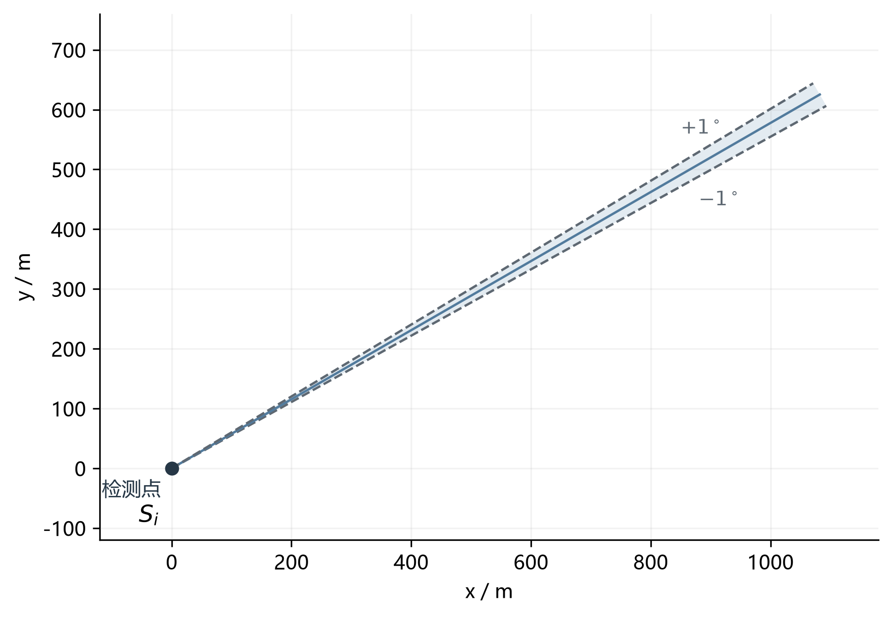

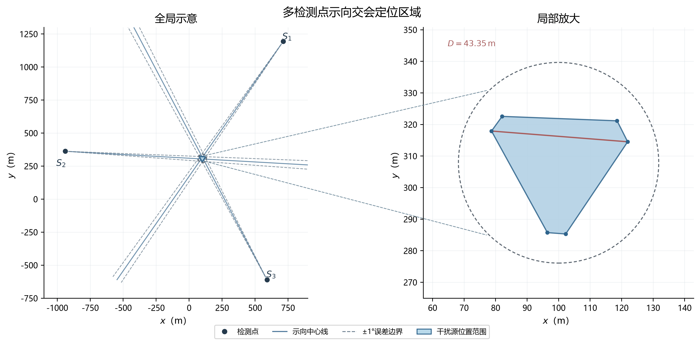

## 3.2 目标圆裁剪与区域直径

目标必定位于以原点 \(O\) 为圆心、半径 \(1800\rm\,m\) 的区域内，故最终定位集合为

\[
\Omega=P\cap B(O,1800).
\]

若 \(P\) 的全部顶点位于目标圆内，由凸性知圆域约束不生效；否则，定位边界同时包含线段与真实圆弧。为避免正多边形近似带来的系统误差，计算中保留解析圆弧。

区域直径定义为

\[
D=\max_{x,y\in\Omega}\|x-y\|_2.
\]

纯凸多边形的最远点对出现在顶点；当圆边界参与裁剪时，还需检查线段端点对应的反向圆周点和有效圆弧之间的对径候选，以覆盖圆弧内部极值。

为说明候选集合的完备性，将 \(\partial\Omega\) 分解为有限条线段与圆弧。若最远点对分别落在两条线段上，距离函数在每个线段参数上均为凸函数，最大值可在端点组合中取得；若一个点为线段端点、另一个点位于圆弧内部，则圆弧点必须位于该端点关于圆心的反向射线上，故只需检查该反向圆周点是否落在有效圆弧内；若两个点均位于圆弧内部，则内部极值只能是目标圆的一对有效对径点。于是，算法只需枚举

\[
\mathcal C_D=
\{\text{边界端点对}\}
\cup\{\text{端点—反向弧点}\}
\cup\{\text{有效对径点}\},
\]

并计算

\[
D=\max_{(x,y)\in\mathcal C_D}\|x-y\|_2.
\]

这既覆盖了圆弧内部最远点，也避免用高边数正多边形逼近圆周所产生的离散误差。

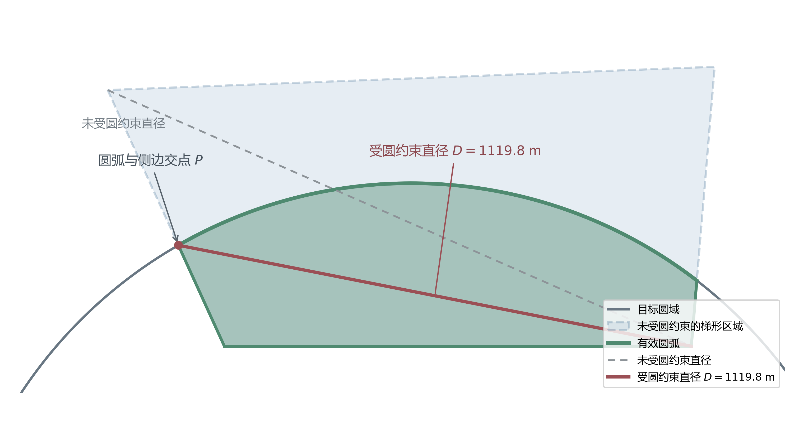

## 3.3 直径圆覆盖问题与 Jung 定理

区域直径只描述集合内部最远两点间距，并不等于最小覆盖圆直径。设 \(R_{\min}\) 为平面有界集合的最小覆盖圆半径。Jung 定理给出

\[
R_{\min}\le \frac{D}{\sqrt 3},
\qquad
2R_{\min}\le\frac{2D}{\sqrt3}\approx1.155D.
\]

由于 \(2/\sqrt3>1\)，该普适上界已经表明不能一般性地保证“直径为 \(D\) 的圆必能覆盖直径为 \(D\) 的集合”。但 Jung 定理并不意味着所有集合都无法被直径圆覆盖；要否定普遍命题，还需给出具体反例。

仓库中的三站合法观测形成六边形可行域，其解析结果为

\[
D=43.348530\rm\,m,
\qquad
2R_{\min}=46.196234\rm\,m>D.
\]

对应最小覆盖圆半径为 \(23.098117\rm\,m\)，而由最远点对构造的直径圆半径仅为 \(21.674265\rm\,m\)，且有两个六边形顶点落在该直径圆外。因此，直径为 \(D\) 的圆不能覆盖此定位区域。

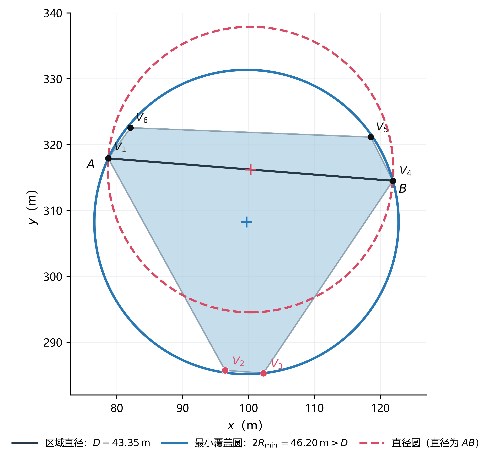

这一结论直接约束问题三的安全清除判据：即使定位区域直径不超过 \(40\rm\,m\)，也不能保证存在半径 \(20\rm\,m\) 的覆盖圆，故后续必须使用最小包围圆而非区域直径签发清除证书。

# 4 问题二：第二检测点的主动选择

## 4.1 第一观测后的目标区域与候选域

第一次观测后，由问题一的方法得到目标可能区域 \(\mathcal F_1\)。第二检测点 \(s\) 的选择需同时满足可达性与题目边界约束，并综合考虑在未知接收半径下再次接收信号的可能性、与第一条方位形成的交会角以及移动成本。于是，问题二实质上是在 \(\mathcal F_1\) 上进行主动实验设计：选择一个位置，使尚未发生的第二次观测尽可能收缩硬可行域。

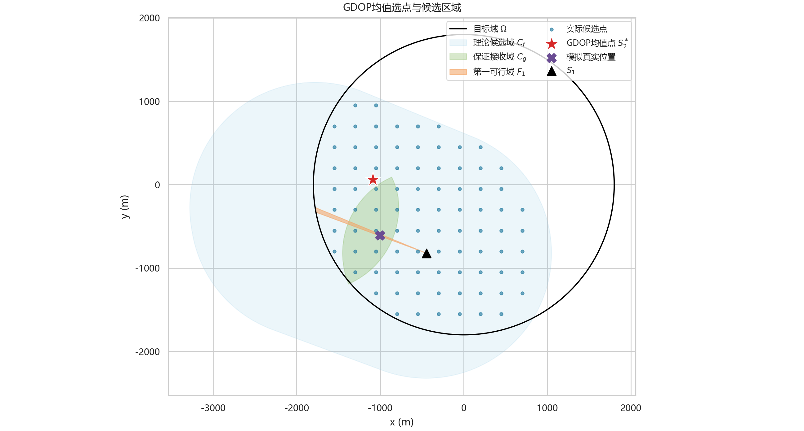

## 4.2 四类第二点策略

对目标样本 \(x\)、第一检测点 \(s_1\) 和候选点 \(s\)，令两条视线夹角为 \(\alpha(x;s_1,s)\)，距离分别为 \(d_1,d_2\)。第一次观测只把目标限制在连续区域 \(\mathcal F_1\) 内，而不是给出唯一点估计。为评价一个候选点在整个区域上的表现，从 \(\mathcal F_1\) 选取 \(M\) 个代表样本 \(x^{(1)},\ldots,x^{(M)}\)，对每个样本计算两站观测几何，再对样本聚合。这样可避免仅以可行域中心代替全部位置不确定性。

| 策略 | 核心思想 | 特点 |
|---|---|---|
| GDOP Mean | 最小化目标样本上的平均 \(\sqrt{\operatorname{tr}(J^{-1})}\) | 综合定位质量最好 |
| Geometry | 最大化接收加权交会质量 | 计算极快、移动较少 |
| FIM E-optimal | 最大化平均 \(\lambda_{\min}(J)\) | 保护最弱信息方向，移动短 |
| Random | 在相同候选域随机选点 | 无优化基线 |

纯方位局部信息矩阵可写为

\[
J(x;s_1,s)=\sum_{k=1}^{2}
\frac{1}{\sigma_\theta^2d_k^2}
\left(I-g_kg_k^{\mathsf T}\right),
\]

其中 \(g_k\) 是从目标指向第 \(k\) 个检测点的单位向量，\(\sigma_\theta\) 是为构造信息几何代理而设置的统一角度尺度。两条视线接近平行时，\(J\) 的一个特征值趋近于零，意味着垂直于强信息方向的位置误差会被显著放大；两条视线具有较大交会角时，信息在平面内更均衡。四种策略对这一几何事实采用了不同的聚合方式。

### 4.2.1 GDOP Mean：控制总体几何放大

对候选点 \(s\)，定义平均几何精度因子

\[
\Phi_{\rm GDOP}(s)=\frac{1}{M}\sum_{m=1}^{M}
\sqrt{\operatorname{tr}\!\left[J(x^{(m)};s_1,s)^{-1}\right]}.
\]

GDOP Mean 选择

\[
s_2^{\rm GDOP}=\arg\min_{s\in\mathcal C}\Phi_{\rm GDOP}(s),
\]

其中 \(\mathcal C\) 为通过可达性和接收可能性筛选后的候选域。迹包含两个方向上的方差代理，因而该准则同时惩罚总体信息不足和近平行交会。对奇异或数值上近奇异的 \(J\)，将候选赋予很大惩罚，避免机器人选择几乎不能补充新方向信息的位置。该策略在整个 \(\mathcal F_1\) 上取平均，故不会只优化某一个代表点；其代价是每个候选都需要反复构造并求逆信息矩阵。

### 4.2.2 Geometry：直接评价接收与交会几何

Geometry 不计算矩阵逆，而使用

\[
Q_{\rm geo}(s)=
\mathbb E_{x\in\mathcal F_1}
\left[
\mathbf 1\{d_2\le R\}
\frac{|\sin\alpha|}{\sqrt{d_1d_2}}
\right]
\]

作为快速代理，并取

\[
s_2^{\rm Geo}=\arg\max_{s\in\mathcal C}Q_{\rm geo}(s).
\]

式中，\(\mathbf 1\{d_2\le R\}\) 抑制很可能收不到信号的位置，\(|\sin\alpha|\) 在交会角接近 \(90^\circ\) 时最大，而 \(1/\sqrt{d_1d_2}\) 避免为了追求正交而选择过远的检测点。该指标把“能否收到—交会是否稳定—测点是否过远”压缩为一个可直接计算的几何分数，不需要对每个候选求矩阵逆，因此速度最快。它的局限是各因素以乘积形式组合，不能像 GDOP 那样直接刻画两个信息特征方向的共同退化。

### 4.2.3 FIM E-optimal：保护最弱信息方向

FIM E-optimal 关注 \(J\) 的最小特征值：

\[
\Phi_{\rm E}(s)=\frac{1}{M}\sum_{m=1}^{M}
\lambda_{\min}\!\left(J(x^{(m)};s_1,s)\right),
\qquad
s_2^{\rm E}=\arg\max_{s\in\mathcal C}\Phi_{\rm E}(s).
\]

\(\lambda_{\min}(J)\) 越大，最难辨识方向所获得的信息越多，因此该准则具有明确的“补短板”含义。与 GDOP Mean 相比，E-optimal 只直接关注较小特征值，对另一个方向及不同目标样本间的极端情况不够敏感；候选点在平均意义上改善最弱方向，并不保证硬可行域的直径尾部同步缩短。这解释了其移动距离较短、但少数场景定位区域仍很长的实验现象。

### 4.2.4 Random：保持候选域一致的无优化对照

Random 不改变候选域 \(\mathcal C\)，只使用固定随机种子从中抽取第二检测点。它与三种确定性策略共享同一可达性和基本接收筛选，因此性能差异主要反映“是否利用观测几何”，而不是候选范围不同。固定随机种子保证实验可复现，但 Random 不代表最坏选点，其作用是给出无主动优化时的经验基线。

上述四种策略都只决定第二检测点，不改变问题一的定位规则。尤其是 FIM/GDOP 中的高斯形式和 Geometry 中的接收权重都只是候选排序代理；题目没有给出相应概率先验，第二次观测后的最终定位质量仍统一按 \(\pm1^\circ\) 硬误差可行域及其直径评价。由此，策略比较是在同一“硬集合裁判”下比较不同的主动测量设计，而不是用各自的代理目标给自己评分。

## 4.3 粗到细搜索

为避免高分辨率全域穷举，三个确定性策略共享

\[
250\rm\,m\rightarrow100\rm\,m\rightarrow50\rm\,m
\]

的粗到细网格：先在全候选域识别优良区域，再逐层缩小搜索范围。相同候选域、相同分辨率序列保证策略比较的公平性，同时将计算集中于有希望的位置。

## 4.4 策略比较结果

固定正式批次包含 10,000 个有效模拟场景，第二次观测后定位区域直径统计如下。

| 策略 | mean \(D\)/m | median/m | P90/m | P95/m | max/m |
|---|---:|---:|---:|---:|---:|
| GDOP Mean | **52.38** | **47.54** | **71.66** | **81.12** | **306.71** |
| Geometry | 67.67 | 56.27 | 120.21 | 142.46 | 453.83 |
| FIM E-optimal | 193.41 | 66.42 | 609.44 | 817.15 | 1352.20 |
| Random | 588.04 | 278.29 | 1495.00 | 1495.00 | 1495.00 |

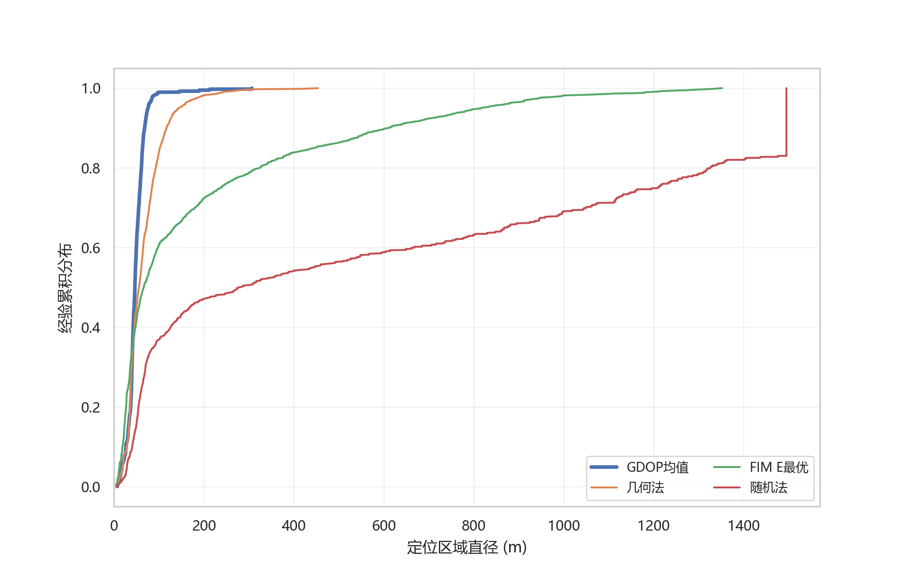

GDOP Mean 的均值、中位数和尾部指标均最优，是综合定位表现最好的方案。Geometry 的平均移动距离为 \(920.39\rm\,m\)，选点耗时中位数仅 \(0.015\rm\,s\)，适合作为效率型竞争方案。FIM E-optimal 的平均移动仅 \(389.17\rm\,m\)，但定位直径长尾明显，说明单纯保护局部最弱信息方向不能充分控制硬集合的全局形状。Random 的平均直径和无信号率均明显较差，只作为无优化基线。

问题二由此把问题一的“被动计算可行域”推进为“主动选择收缩可行域的观测”。在问题三中，不再孤立求一个最优第二点，而是将交会角、信息几何和接收可能性用于局部候选生成与排序，并与全局移动和清除任务联合决策。

# 5 问题三：全向干扰源的保证型动态搜索

## 5.1 确定性保证层与动态时间优化层

问题三同时包含

\[
\text{发现}+\text{定位}+\text{移动}+\text{频道调度}
+\text{清除}+\text{终止判断}.
\]

最终策略 `candidate_057_posterior_free` 采用双层结构。确定性保证层负责全局发现覆盖、每频道硬可行域、安全清除证书和有限终止；动态时间优化层负责服务顺序、覆盖顺序、测量点、共享停靠、完成代价预演与有限光学试探。优化层可以改变动作顺序，却不能删减硬可行状态、放宽清除证书或绕过终止条件。

两层并非彼此独立。保证层把当前各频道状态、剩余覆盖点和可清除证书交给优化层；优化层只在这些合法任务之间决定“先做什么”和“在哪里做”。动作执行后，新的观测首先进入保证层更新硬状态，再由优化层重新排序。因而即使时间估计或软排序存在偏差，最坏后果也是路线效率下降，而不会把尚不安全的目标误判为可清除，也不会把尚未完成的搜索误判为结束。

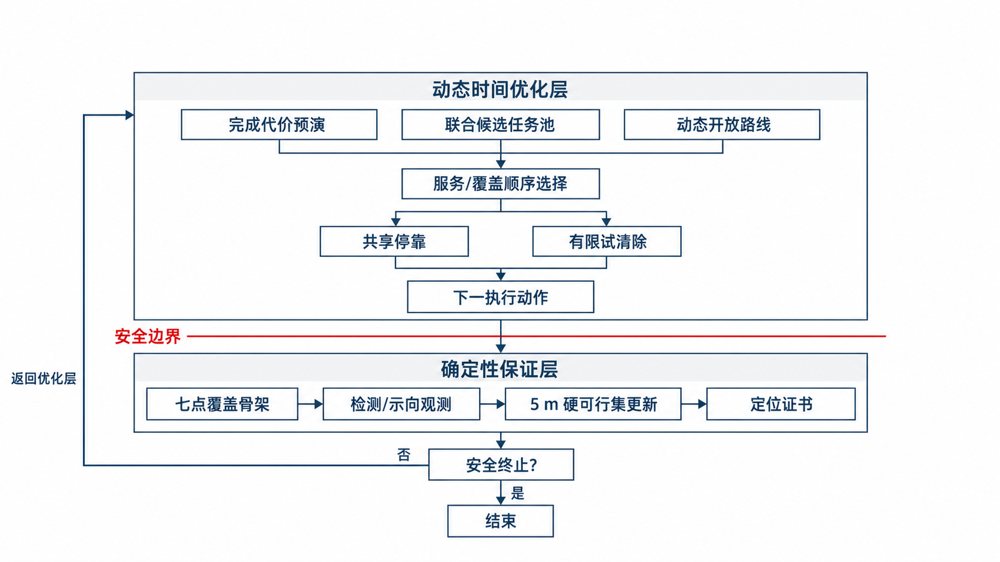

## 5.2 七点覆盖与分频道硬状态

全向源的最小接收半径为 \(1000\rm\,m\)。取原点和半径 \(1200\rm\,m\) 的正六边形六顶点作为七个覆盖点。对半径 \(1800\rm\,m\) 的目标圆，任一点到最近覆盖点的最坏距离为

\[
d_{\max}=968.902\rm\,m<1000\rm\,m,
\]

安全裕量为 \(31.098\rm\,m\)。故完整扫描七点后，全向源必至少在一个覆盖点被接收，仍未发现的频道可认证为不存在。

20 个频道分别维护

\[
\mathrm{UNKNOWN}\rightarrow\mathrm{FOUND}\rightarrow\mathrm{CLEARED},
\]

或

\[
\mathrm{UNKNOWN}\rightarrow\mathrm{ABSENT}.
\]

对每个已发现频道，用边长 \(5\rm\,m\) 的闭方格外包连续可行域。`direction` 仅保留满足示向楔形、目标圆域、最大接收距离和近区规则的方格；`no signal` 仅删除可证明处于 \(1000\rm\,m\) 必接收圆内的方格；`near` 则触发当前位置清除。网格是对连续可行域的保守外包，其作用是保持安全性与计算可控，而非提高名义精度。

更具体地，设检测前频道 \(c\) 的连续硬可行域为 \(H_c^{-}\)，检测位置为 \(s\)。若得到示向 \(\hat\theta\)，则用

\[
H_c^{+}=H_c^{-}\cap W(s,\hat\theta,\varepsilon)
\cap B(s,1500)\setminus B^\circ(s,5)
\]

更新，其中 \(W\) 是问题一的前向楔形；正信号说明目标不会超过最大接收半径，且 `direction` 与 `near` 互斥。若得到 `no signal`，全向源在 \(1000\rm\,m\) 内必可接收，故安全更新为

\[
H_c^{+}=H_c^{-}\setminus B^\circ(s,1000).
\]

若得到 `near`，则 \(H_c^{+}=H_c^{-}\cap B(s,5)\)，并在当前位置进入光学清除流程。实际计算不直接存储连续集合 \(H_c\)，而保留与其相交的 5 m 闭方格；只有当一个方格可被观测约束完全排除时才删除，从而使网格集合始终是连续真值集合的外包。若数值运算意外产生空集，则保留上一次非空硬超集并记录异常，避免以数值故障签发错误证书。

状态 `ABSENT` 只在七点覆盖全部完成后赋给仍为 `UNKNOWN` 的频道。单个位置的 `no signal` 只能缩小该频道的位置集合，不能证明频道不存在；同样，某一频道已经清除也不能替代其他频道的覆盖扫描。这一状态语义把局部观测结论和全局存在性结论严格分开。

<p align="center">
  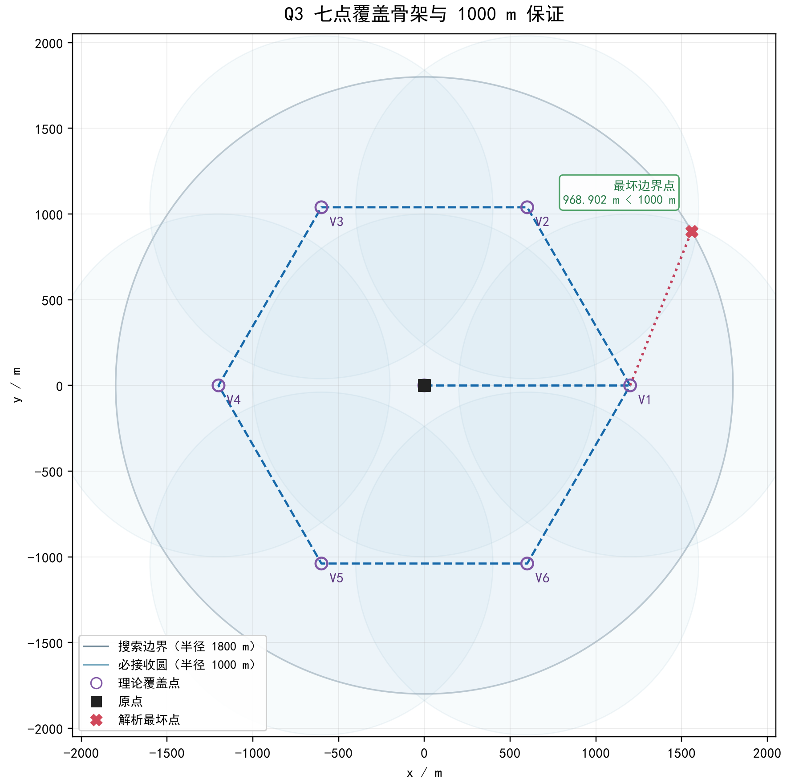
  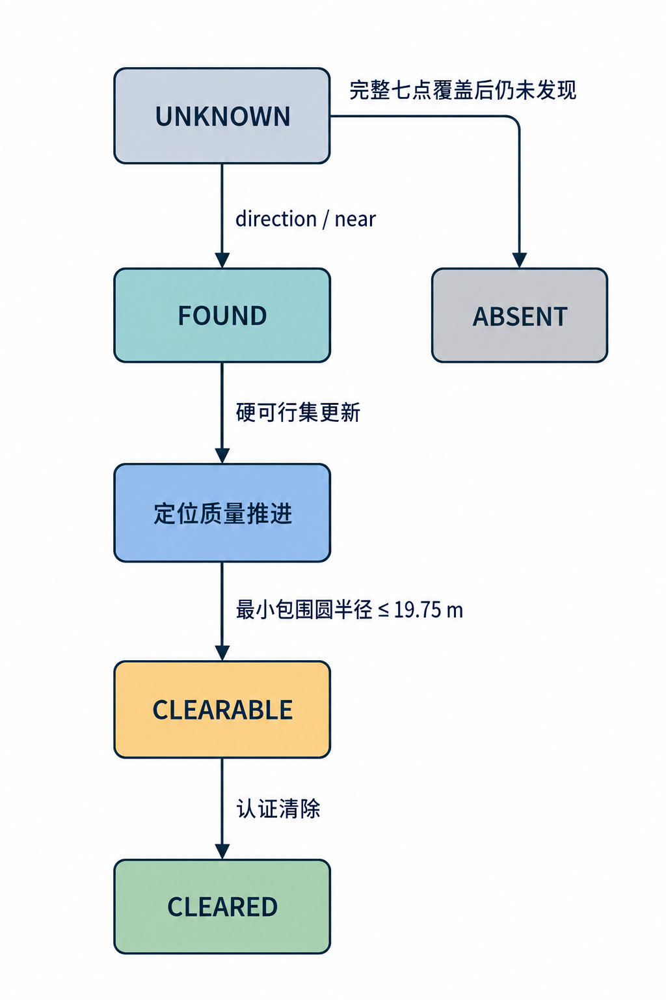
</p>

## 5.3 安全定位、清除与有限兜底

对频道 \(c\) 的保留方格集合 \(\mathcal G_c\)，取所有方格角点集合 \(V_c\)，计算其最小包围圆

\[
(q_c,r_c)=\operatorname{MEC}(V_c).
\]

由于 \(V_c\) 外包连续可行域，仅当

\[
r_c\le 20-0.25=19.75\rm\,m
\]

时，才前往圆心 \(q_c\) 执行认证清除。\(0.25\rm\,m\) 为数值与离散化安全裕量。此判据保证所有仍相容的位置都在 \(20\rm\,m\) 光学清除范围内。

这里使用最小包围圆而非“可行区域直径不超过 \(40\rm\,m\)”，正是因为问题一已证明区域直径不能替代覆盖半径。将所有保留方格的角点纳入 MEC 还解决了另一个问题：若只使用方格中心，真实目标可能位于边角处并超出清除半径；角点证书则覆盖整个闭方格。

若常规定位在 6 条方位信息后仍未形成证书，则为剩余可行方格生成有限的无缝光学覆盖点。每个覆盖点负责一片不超过 \(20\rm\,m\) 光学半径的剩余区域，访问成功即可清除；失败则排除相应近邻区域并转向下一个点。由于初始方格数有限、兜底点数有限，且每次兜底尝试都会清除目标或排除一个已覆盖子集，因此该流程不会无限追加无线观测。七点发现覆盖、有限网格和有限光学覆盖共同给出了完整的有限终止结构。

## 5.4 动态路线与时间优化

每次根据当前状态生成五类候选任务：未完成覆盖点、继续定位点、已认证清除点、可共享测量点和有限光学试探点。候选节点被组织为从机器人当前位置出发的开放路线；控制器只执行当前路线首节点，收到新观测后立即重建状态并重新规划。

单个候选动作的评价不仅包含眼前代价，还估计其完成代价：

\[
C_{\rm preview}=
C_{\rm now}+C_{\rm localize}+C_{\rm coverage}+C_{\rm clear}.
\]

其中 \(C_{\rm now}\) 包含当前移动与操作时间，后三项分别近似后续定位、剩余覆盖和清除成本。自由覆盖顺序允许在不破坏覆盖证书的前提下调整覆盖点次序；共享停靠使一个位置服务多个活跃频道；有限光学试探只在预算内沿既有路线触发，失败成本被如实计入，并用合法负信息更新状态。

定位候选首先由当前硬可行域的尺度、边界位置和已有方位方向生成，再借用问题二的交会角与信息几何判断其观测价值。所谓共享停靠，是在不显著增加当前路线长度时，让同一位置依次测量多个活跃频道；它减少的是重复移动，不能跳过某个频道所需的硬集合更新。完成代价预演则比较“立即清除”“再测一次后清除”和“先完成附近覆盖再返回”等后续情形，避免仅凭最近距离做出短视决策。

问题二的信息几何在此转化为局部测量候选与排序原则，而非独立的“第二点最优解”。软后验只参与候选排序和完成代价估计，不得用于删除硬方格、签发安全清除证书或作最终终止判断。正常退出仅有两种情形：已清除 16 个源；或七点覆盖完成、其余频道被认证不存在且所有已发现源均已清除。该滚动策略是可解释的启发式联合优化，不声称求得全局 TSP 最优解。

Q3 的完整在线决策过程可概括为以下伪代码。

```text
算法 1  全向多源的保证型滚动搜索
输入：20 个频道，七点覆盖骨架，5 m 硬网格，动作时间参数
输出：各频道终态及累计虚拟时间

1  初始化所有频道为 UNKNOWN；初始化七个覆盖点为未完成
2  在原点扫描频道，并按 direction / near / no signal 更新硬状态
3  while 未满足终止条件 do
4      若七点覆盖已完成：
5          将仍为 UNKNOWN 的频道标记为 ABSENT
6      对每个 FOUND 且未清除的频道 c：
7          计算全部保留方格角点的 MEC(q_c, r_c)
8          若 r_c ≤ 19.75 m，则生成认证清除任务
9          否则生成几何定位候选；达到常规观测上限后生成有限光学兜底
10     生成尚未完成的覆盖任务、共享停靠任务与预算内试探任务
11     对合法任务估计当前成本与后续完成代价，构造开放路线
12     仅执行路线首节点，并读取机器人可见反馈
13     先按硬规则更新频道状态与可行方格
14     再更新只用于候选排序的软评分，不允许其改变第 13 行结果
15 end while
16 若已清除 16 个源，或覆盖完成且其余频道 ABSENT、已见频道全清，则正常退出
```

伪代码中的第 13—14 行体现了模型的安全边界：同一条反馈先决定不可撤销的硬状态，再影响可随时失效的效率排序。第 11—12 行体现滚动时域思想：每次只承诺首个动作，后续路线始终允许被新信息修正。

## 5.5 实验结果与正式测试

在种子 20261210—20261239 的 30 场严格配对实验中，四个策略共享场景、频道和位置固定误差，均完成全部场景。结果如下。

| 策略 | 场均时间/s | 总时间/总源数 \(\mathrm{s/源}\) | P95 场总时间/s |
|---|---:|---:|---:|
| 041 | 3795.54 | 287.54 | 4219.30 |
| 049 | 3540.30 | 268.20 | 3922.27 |
| 053 | 3460.51 | 262.16 | 3830.04 |
| 057 | **3442.53** | **260.80** | **3829.40** |

057 相对 041 平均节省 \(353.01\rm\,s/场\)，折合 \(26.74\rm\,s/源\)，改善 \(9.30\%\)，且 30/30 场均更快。另一批 100 场规模测试中，057 完成 100/100 场并清除 1291/1291 个源，总时间折合 \(256.01\rm\,s/源\)，场总时间 P95 为 \(3703.95\rm\,s\)。这些均为本地模拟结果；高并发运行的墙钟吞吐不属于比赛性能。

正式测试日志提供了下列独立记录。

| 测试 | 已清除数 | 程序运行时间/s | 平均定位清除时间 \(\mathrm{s/个}\) |
|---|---:|---:|---:|
| Q3-1 | 15 | 3769.413 | 251.294 |
| Q3-2 | 14 | 3430.601 | 245.043 |
| Q3-3 | 12 | 3169.897 | 264.158 |

三份日志均缺少案例编码和真实总源数，故这里只报告成功清除数与虚拟时间，不声称三局均已全清，也不将正式三局与本地批量样本合并统计。

# 6 问题四：定向源条件下的鲁棒扩展

## 6.1 全向可见假设的失效

问题四不是重新建立一套无关模型，而是放松问题三的全向可见性假设。问题三中，若候选位置 \(x\) 满足 \(|x-s|\le1000\rm\,m\)，则全向源必被接收，因而

\[
\text{no signal}\Rightarrow x\text{ 可被排除}.
\]

定向源仅在未知 \(180^\circ\) 半平面内辐射。此时 `no signal` 可能表示距离过远、机器人位于发射盲区，或频道确实不存在，因此不能直接删除空间候选，也不能沿用七点扫描后的不存在认证。

设源位置为 \(x\)，发射方向单位向量为 \(v(\phi)\)，机器人位于 \(s\)。忽略误差时，定向源的可见条件可表示为

\[
\|s-x\|\le R,
\qquad
(s-x)^{\mathsf T}v(\phi)\ge0.
\]

因此，负观测只说明上述两个条件至少一个不成立。由于 \(\phi\) 未知，对于一个距机器人不足 \(1000\rm\,m\) 的位置候选，仍可能存在某个方向使机器人落在背向半平面内；把方向变量消去后，单次负观测一般不能安全排除该位置。相比之下，正示向仍直接限制目标位置，因此 Q4 的硬位置集合主要由正观测收缩，负观测只用于可见性和路线启发，不越权修改安全可行域。

| 条件 | Q3 全向源 | Q4 定向源 |
|---|---|---|
| 正示向 | 楔形约束 | 楔形约束 |
| `no signal` | 必接收半径内可排除位置 | 不能直接排除位置 |
| 发现覆盖 | 七点可作存在性认证 | 需要更密的定向可见性兜底 |

最终策略 `adaptive_double_ring_clear_probe` 对正示向使用带 \(\pm1.01^\circ\) 数值余量的楔形，并与目标圆和 \(1500\rm\,m\) 正信号范围相交；负观测只按其真实可见性语义保守处理。

## 6.2 25 点双环发现与安全终止

策略使用 25 点双环结构维持定向源的发现兜底。设计目标不再只是“每个位置距某检测点小于 \(1000\rm\,m\)”，还要求对任意未知的 \(180^\circ\) 发射方向，至少存在一个既位于必接收距离内、又落在发射半平面中的检测点。

取中心点 \(O=(0,0)\)，内、外环各布置 12 点。令

\[
r_i=980,\qquad
r_o=\frac{1800}{\cos15^\circ}+0.25\approx1863.747,
\]

并对 \(k=0,\ldots,11\) 定义

\[
\begin{aligned}
A_k&=r_o(\cos30k^\circ,\sin30k^\circ),\\
B_k&=r_i(\cos(30k+15)^\circ,\sin(30k+15)^\circ).
\end{aligned}
\]

外环正十二边形包含整个半径 \(1800\rm\,m\) 的目标圆，内环相对外环旋转 \(15^\circ\)。利用下标模 12 的三类三角形

\[
(O,B_k,B_{k+1}),\qquad
(A_k,B_{k-1},B_k),\qquad
(A_k,A_{k+1},B_k)
\]

可将外接十二边形完整剖分。四类可能边长分别为

\[
\begin{aligned}
\|O-B_k\|&=980.000,\\
\|B_k-B_{k+1}\|&=507.285,\\
\|A_k-A_{k+1}\|&=964.747,\\
\|A_k-B_k\|&=951.567,
\end{aligned}
\qquad \text{单位：m},
\]

均严格小于最小接收半径 \(1000\rm\,m\)。

任一源位置 \(x\) 必位于上述某个三角形内。点到固定顶点的距离是凸函数，因此 \(x\) 到该三角形三个顶点的距离均不超过三角形最长边，进而均小于 \(1000\rm\,m\)。另一方面，任何经过 \(x\) 的闭半平面至少包含该三角形的一个顶点；否则三个顶点都位于另一开半平面，其凸包也不可能包含 \(x\)。所以，无论定向源的 \(180^\circ\) 发射方向如何，包含 \(x\) 的发射半平面内至少存在一个可接收的覆盖点。逐频道完成 25 点扫描即可形成确定性的发现证书。

该证明只保证源至少被发现一次，不能推出已获得两条独立示向，也不能推出位置集合已缩小至光学清除尺度。因此，双环发现之后仍需正示向交会、无线重捕获和局部光学收尾。

与问题三不同，覆盖点不会因已清除某个源、在路线中经过附近或已经发现若干频道而被替代、跳过或删除。原因是清除位置取决于已发现源，不能反向证明未知定向源在该位置可见；如果用清除点替换固定发现点，可能在某一发射方向上留下不可见空洞。对已发现但尚未收敛的定向源，策略还保留无线重捕获和完整正示向光学条带回退，使“发现过但后来暂时无信号”的频道仍有确定的收尾路径。

当已发现 16 个互异频道时，由题目给定的源数上限可停止扫描剩余未知频道，转入已知源收尾；若已见频道少于 16，则不能因长时间没有新源、已经清除若干源或到达某时间阈值而提前终止。

这里应区分“停止寻找未知频道”和“任务结束”。发现 16 个频道只说明无需继续寻找第 17 个频道，尚未清除的已知频道仍必须完成定位和安全收尾；未达到 16 个频道时，则必须继续执行固定发现骨架。只有发现阶段和已知频道收尾阶段各自满足条件，算法才可正常退出。

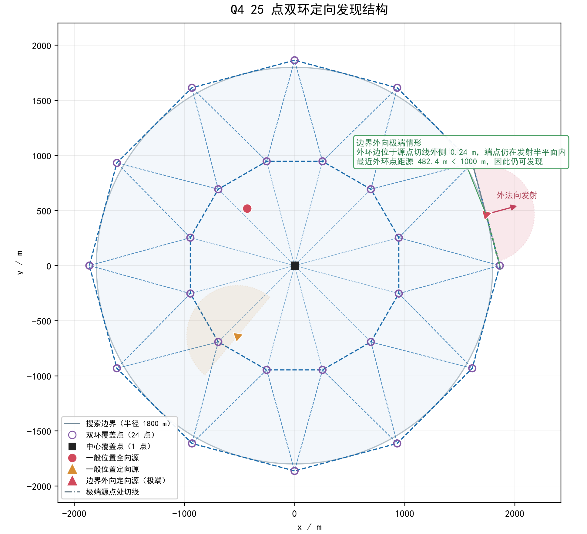

## 6.3 50 m 认证区域与十点光学环

对已发现目标，只由正示向形成硬可行多边形。每次正观测都增加一个楔形与最大接收距离约束；多次观测求交后，计算该多边形的最小包围圆。当整个正示向可行多边形能被半径 \(50\rm\,m\) 的圆完整覆盖时，模型不再依赖可能持续失效的无线重捕获，而转入局部确定性光学阶段：先在圆心尝试清除；若失败，则依次访问以该圆心为中心、半径 \(36\rm\,m\) 的 10 个等角环点。

相邻环点圆心角为 \(36^\circ\)，任意目标方向与最近环点方向的夹角不超过 \(18^\circ\)。设目标距认证圆心为 \(\rho\in[20,50]\rm\,m\)，则其到最近环点的距离满足

\[
d^2(\rho)=\rho^2+36^2-72\rho\cos18^\circ.
\]

该凸二次函数在闭区间上的最大值出现在端点。代入 \(\rho=20\) 与 \(50\) 可得最坏值出现在 \(\rho=50\)：

\[
d_{\max}=
\sqrt{50^2+36^2-2\times50\times36\cos18^\circ}
=19.2924\rm\,m<20\rm\,m.
\]

当 \(\rho<20\rm\,m\) 时圆心尝试已经覆盖目标；当 \(\rho\in[20,50]\rm\,m\) 时至少一个环点距目标小于 \(20\rm\,m\)。因此“圆心 + 十点环”对整个 \(50\rm\,m\) 认证圆形成确定性光学覆盖。圆心尝试成功时立即停止访问其余环点；只有失败才继续沿环执行，故典型成本低于完整兜底成本。最坏局部尝试成本为 \(82.2486\rm\,s\)，该值不含前往圆心的移动，也不是全任务完成时间上界。

## 6.4 自适应路线与顺路补测

未访问发现点、已定位清除点和活跃频道测量机会被统一放入开放路线。每轮从机器人真实位置重建路线，只执行首节点后重规划。成功清除后，可利用实际清除位置顺路为至多两个活跃频道补测，减少重复移动。

候选排序综合距离、交会角、可行域预期收缩和可见性启发式。发现点提供未知频道的全局可见机会，活跃频道测量点改善正示向交会，清除点和光学环负责完成已认证的局部任务。将三者放入同一开放路线，可避免先机械走完全部发现点、再逐个返回定位的重复路程。

顺路补测只发生在成功清除后的真实位置，并限制服务频道数，防止一次停靠产生过多切频和检测成本。若该位置对某活跃频道得到正示向，则立即收缩其硬多边形；若无信号，只降低该位置的后续排序价值，不直接删除位置候选。上述机制只提升效率：发现点仍需完成，正示向硬区域仍按保守规则更新，50 m 认证与光学环覆盖条件也不被放宽。策略只读取机器人通过正式接口获得的响应，不读取真实源数量、位置、类型、方向或接收半径等隐藏信息。

Q4 的发现、定位与收尾闭环可概括为以下伪代码。

```text
算法 2  定向源条件下的双环发现与确定性光学收尾
输入：20 个频道，25 点双环发现骨架，动作时间参数
输出：已清除频道集合及累计虚拟时间

1  初始化频道状态、正示向可行多边形和 25 个未访问发现点
2  while 未满足终止条件 do
3      若已发现 16 个互异频道：
4          停止未知频道扫描，但保留所有已知频道收尾任务
5      否则：
6          保留全部尚未访问的固定双环发现点
7      对每个已发现且未清除的频道 c：
8          用新的正示向楔形收缩硬可行多边形 H_c
9          对 no signal 仅更新可见性排序，不直接删除 H_c 中的位置
10         计算 H_c 的最小包围圆 (q_c, r_c)
11         若 r_c ≤ 50 m，则生成“圆心 + 36 m 十点环”清除任务
12         否则生成无线重捕获、交会定位或正示向条带回退任务
13     将发现点、活跃测量点和清除点组成开放路线
14     只执行首节点；根据返回结果更新频道状态
15     若清除成功，则在该位置为至多两个活跃频道顺路补测
16     若圆心清除失败，则按十点环顺序执行，成功后立即停止该环
17 end while
18 仅在未知频道搜索已合法停止且全部已知频道清除后退出
```

第 6 行保证效率动作不能删去固定发现骨架，第 9 行保证负观测不会被误写成位置排除，第 11 与第 16 行则把无线定位的不确定性转化为有限的确定性光学覆盖。三条规则共同构成 Q4 相对 Q3 的核心修改。

为配合伪代码中的单频道处理闭环，图中将一个已发现频道的局部几何过程压缩为四个连续环节：由正示向形成初始扇形约束，经过多次楔形求交收缩硬可行域，计算最小包围圆形成清除认证，最后执行“圆心 + 十点环”的光学清除。图内仅保留序号、表头和必要的短标签；第一环节的扇形外缘仅作视觉放大，真实模型仍使用 ±1° 示向误差；第二、三环节采用不对称检测点示意不规则六边形可行域，不代表某一正式测试案例的具体坐标。

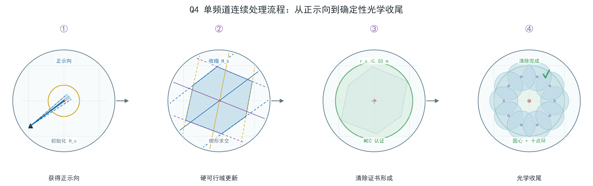

## 6.5 实验结果与正式测试

参数锁定后的五个互不重叠本地验证集合共 1000 例，Adaptive 策略 1000/1000 最终全清。代表性结果如下。

| 场景 | 基线均值/s | Adaptive 均值/s | 主要结论 |
|---|---:|---:|---|
| 混合 300 | 6641.99 | **6377.34** | 改善 3.98% |
| 全定向 300 | 7443.91 | **7056.22** | 改善 5.21% |
| 固定 16 源混合 200 | 6337.99 | **5742.93** | 改善 9.39% |

混合 300 例中，平均移动时间减少 \(191.21\rm\,s\)，测量时间减少 \(76.03\rm\,s\)，而光学时间增加 \(17.64\rm\,s\)；这说明收益主要来自较少移动与无线测量，而非省略安全动作。定向场景整体明显更困难，且候选并非逐例占优，因此结论限于该实验设计下的平均与尾部改善。

正式三局记录如下。

| 测试 | 已清除数 | 程序运行时间/s | 平均定位清除时间 \(\mathrm{s/个}\) |
|---|---:|---:|---:|
| Q4-1 | 12 | 6366.440 | 530.537 |
| Q4-2 | 10 | 6161.285 | 616.129 |
| Q4-3 | 16 | 4836.335 | 302.271 |

日志未给出案例编码和真实总源数，因此不能断言前两局全清。Q4-3 清除了 16 个互异频道，达到了题面允许的最大源数；这可确认不存在第 17 个源，但仍应将该判断与日志证据范围区分表述。

# 7 敏感性、鲁棒性与机制解释

## 7.1 Q3：任务规模与空间分布敏感性

本地 100 场规模测试包含 1291 个源并全部清除。总时间与源数的 Spearman 相关系数为 \(0.656\)，说明绝对工作量总体随源数增加；单位源时间与源数的相关系数却为 \(-0.854\)。分层结果中，\(N=10\) 时平均场总时间为 \(2983.52\rm\,s\)，单位源时间为 \(298.35\rm\,s/源\)；\(N=16\) 时两者分别为 \(3416.77\rm\,s\) 和 \(213.55\rm\,s/源\)。

二者并不矛盾。图中每个点是 100 场本地模拟按源数分层得到的均值，折线只用于辅助比较离散源数水平，不代表连续趋势或因果关系。更多源需要更多定位和清除动作，但七点扫描等固定搜索成本可由更多源分摊；特别地，发现 16 个互异频道后已达到题目上限，可以停止未知频道搜索。因此不能把单位源时间下降概括为“源越多越容易”，还应同时报告场总时间和终止机制。

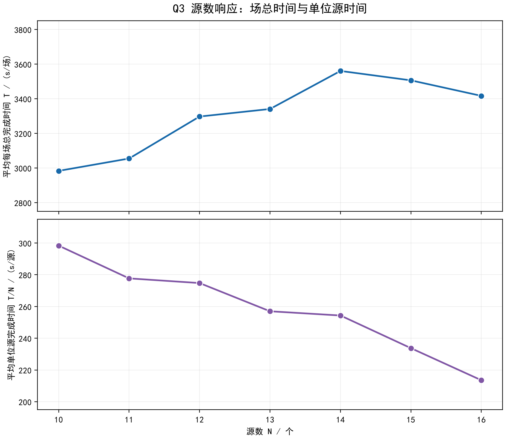

空间结构进一步解释了相同源数下的时间差异。在同时控制源数和若干几何特征的探索性回归中，平均最近邻距离每增加 \(100\rm\,m\)，与场总时间增加 \(137.96\rm\,s\) 相关；平均径向距离每增加 \(100\rm\,m\)，与总时间增加 \(32.96\rm\,s\) 相关。压力筛选中，边界密集场景相对面积均匀场景平均更慢，而聚类场景在全部 18 个配对比较中均更快；近重合目标对也未造成定位失败，反而因共享路线缩短而节省时间。由于压力筛选每个格点仅有 6 场，这些结果用于识别困难模式，不用于估计尾部失败概率。

## 7.2 Q3：成本与模型参数敏感性

100 场中移动、无线测量、切频、光学和激光分别占总虚拟时间的 \(76.15\%\)、\(18.33\%\)、\(3.35\%\)、\(1.39\%\) 和 \(0.78\%\)。因此，问题三的首要优化对象是减少移动与重复服务，而不是继续压缩光学或激光操作时间。这与 057 相对 041 的配对结果一致：平均 \(353.01\rm\,s/场\) 的节省中，移动时间减少约 \(311.81\rm\,s\)。

冻结已有动作和路线，仅改变成本参数进行反事实重算时，速度提高 \(10\%\) 可将汇总指标由 \(256.01\) 降至 \(238.28\rm\,s/源\)，速度提高 \(20\%\) 时降至 \(223.52\rm\,s/源\)；无线测量时间降低 \(10\%\) 时仅降至 \(251.31\rm\,s/源\)。这进一步说明移动是主要成本来源，但冻结轨迹没有包含策略重新决策产生的二阶影响，不能把这些差值解释为真实改参后的严格因果收益。

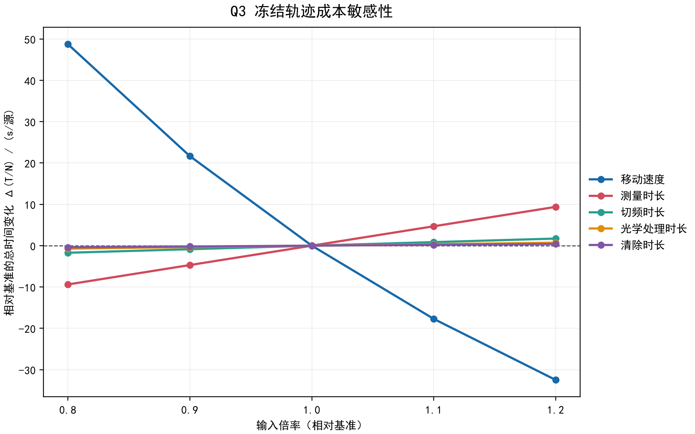

图中纵轴为相对基准的汇总单位源时间变化；每条曲线只改变一个成本输入并冻结已有动作与路线。速度倍率 (0.8) 表示速度降低至基准的 (80\%\)，因此移动时间增加；其斜率和幅度显著大于其他成本项，直观呈现移动成本的主导地位。该图是冻结轨迹下的反事实比较，不表示策略重新决策后的严格因果收益。

新增筛选实验还检验了示向误差与网格尺度。L9 正交筛选中，示向误差上界由 \(0.5^\circ\) 增至 \(1.5^\circ\)，场均时间增加 \(170.49\rm\,s\)，折合增加 \(12.89\rm\,s/源\)，配对 bootstrap 区间不跨 0。误差增大使示向楔形变宽，需要更多移动和观测才能形成清除证书。

在 12 个共同场景的网格筛选中，2.5 m 网格相对 5 m 网格平均增加 \(57.58\rm\,s/源\)，12 场中仅 1 场改善；10 m 网格相对 5 m 增加 \(2.23\rm\,s/源\)，区间跨 0。更细网格虽能减小外包误差，却也改变集合形状、候选生成和后续路线，因而不保证总任务更快。现有证据支持 5 m 作为精度与决策效率之间的稳健折中，但不足以证明其在所有场景中全局最优。

## 7.3 Q4：源数与定向比例的交互

为分离源数和定向比例的影响，构造

\[
N\in\{10,13,16\},
\qquad
p\in\{0,0.25,0.5,0.75,1\}
\]

的 \(3\times5\) 受控全因子实验。每个格点含 100 个基础实例，基线与 Adaptive 严格配对，共 1500 个配对案例、3000 次策略运行，全部最终清除全部干扰源。

<p align="center">
  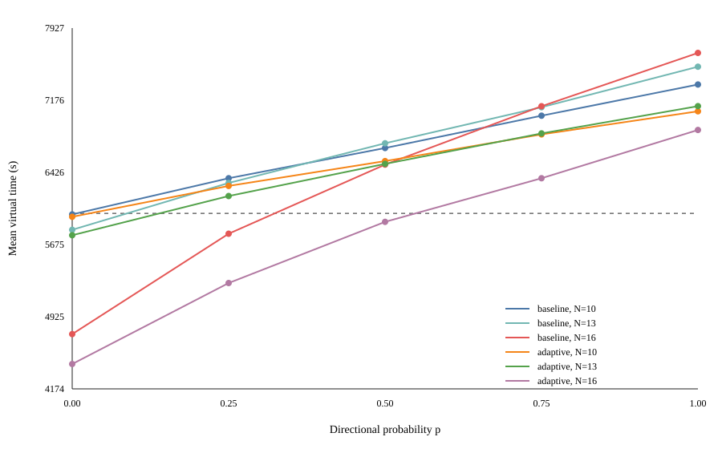
  
</p>

固定 \(N\) 时，平均完成时间随 \(p\) 单调增加。Adaptive 从全向到全定向的平均增时在 \(N=10,13,16\) 时分别为 \(1098.02\rm\,s\)、\(1342.21\rm\,s\) 和 \(2434.10\rm\,s\)，说明定向比例是主要困难因素。源数效应则非单调：低定向比例下，16 源因较早达到已知上限而可能比 10 源更快；高定向比例下，新增源的定位负担逐渐抵消这一收益。

以差中差

\[
I=[T(16,1)-T(16,0)]-[T(10,1)-T(10,0)]
\]

衡量交互，基线与 Adaptive 分别得到 \(1573.04\rm\,s\) 和 \(1336.07\rm\,s\)，相应配对 bootstrap 95% 区间均不跨 0。Adaptive 在 15 个因子格点上的平均时间均低于基线，但平均占优不等于逐局占优。

3000 次运行全部最终全清，而 6000 秒内完成率随 \(N\) 和 \(p\) 显著变化。例如 Adaptive 在 \(N=16\) 时，该比例随 \(p\) 从 0 增至 1 依次为 \(100\%,80\%,53\%,30\%,12\%\)。因此必须分别讨论“最终可靠全清”和“给定时间内完成”，不能用前者替代时间目标。

## 7.4 统计稳定性与证据边界

配对 bootstrap 以基础场景为重采样单元，用于评价平均策略差的稳定性；leave-one-out 逐一删除案例，用于检查结果是否由单个极端场景驱动。Q4 既有混合与全定向数据中，逐一删除任一案例后的平均策略差仍保持为负，支持 Adaptive 平均收益的稳定性。

证据分为四层。半平面交、七点覆盖、双环三角剖分、最小包围圆清除证书和十点光学环上界属于数学或几何保证；Q2 的 10,000 个场景、Q3 的配对与规模测试、Q4 的 1000 例验证及 3000 次受控运行属于本地模拟证据；官方模拟器演练用于检查接口正确性和策略波动范围；正式六局则只按日志如实报告。由于本地生成器的位置、半径、误差和定向比例分布不等于官方隐藏案例分布，任何“100/100”“1000/1000”或“3000/3000”全清都不能外推为连续空间中的零失败概率证明。

# 8 模型评价与讨论

## 8.1 模型优势与局限

| 模型优势 | 模型局限 |
|---|---|
| Q1—Q4 共用有界误差硬可行域语言，章节间逻辑一致 | 5 m 网格外包会引入一定保守性与计算负担 |
| 确定性保证与效率优化分层，软排序不能越过安全边界 | Q3、Q4 的开放路线与完成代价仍为启发式，非全局最优 |
| 清除与终止具有明确证书，避免用经验阈值替代安全条件 | Q4 对负观测利用较保守，可能损失定位效率 |
| Q1 的覆盖反例直接指导 Q3 采用最小包围圆 | 25 点发现结构具有较高的固定移动与测量成本 |
| Q4 明确识别全向负观测逻辑失效，并建立局部确定性收尾 | 本地模拟分布不能代替官方隐藏实例分布 |
| 实验包含配对比较、大样本测试、受控敏感性和正式日志 | 正式测试仅三局且缺少案例码与真实总源数 |

## 8.2 可进一步改进的方向

第一，可将 Q3 的均匀 5 m 网格改为具有包含保证的自适应网格或连续凸集合表示：在方位交会边界和清除证书附近加密，在已被大范围排除的区域保持粗分辨率。这样有望降低状态规模和外包保守性，但任何合并或粗化操作都必须继续包含完整连续可行域。

第二，可在 Q4 中联合维护位置与发射方向的有界可行集合。当前模型为避免错误删除，对负观测利用较保守；若显式引入方向变量，便可把“距离过远或位于背面”的析取约束与历史正观测联合求交，从而安全排除部分位置—方向组合。该方法比单纯概率化负观测更符合本文的硬证书框架，但会增加状态维度和在线计算量。

第三，可研究带连续几何证书的发现点删减与动态替换。25 点双环为定向源提供严格发现保证，却带来较高固定扫描成本；只有在证明剩余检测点对每个可能源位置仍覆盖全部发射半平面后，才可删除或以清除点替换双环点。仅凭有限网格或本地零失败实验不能代替这一连续覆盖证明。

在效率层，可进一步使用更长视野的 belief 或部分可观测规划估计动作的未来价值[6-8]。但这类方法仍应服从本文的分层原则：概率模型只调整候选顺序，硬可行域、发现覆盖、清除证书和有限兜底保持独立，避免以预测收益交换不可恢复的安全性。

# 9 结论

本文形成了

\[
\boxed{
\text{定位}\rightarrow\text{主动感知}\rightarrow
\text{保证型动态搜索}\rightarrow\text{定向鲁棒搜索}}
\]

的统一能力链。问题一以有界误差集合给出可靠的位置描述，并通过 Jung 定理与三站反例澄清直径和覆盖半径的差别；问题二在该硬可行域上选择高价值观测，验证 GDOP Mean 的综合优势与 Geometry 的效率价值；问题三把局部定位嵌入七点覆盖、分频道状态、最小包围圆证书和滚动路线，从而兼顾全部清除的结构性保证与时间优化；问题四则在全向负观测逻辑失效后，以 25 点双环和确定性光学环重新建立发现与收尾可靠性。

实验表明，Q3 的时间瓶颈主要是移动，Q4 的主要困难因素是定向比例，且其影响与源数存在明显交互。由此，进一步改进应优先减少保证结构下的重复移动与无效测量，同时保持硬可行域、清除证书和终止条件不被概率启发式侵蚀。

# 参考文献

[1] Isler V, Bajcsy R. The sensor selection problem for bounded uncertainty sensing models[J]. IEEE Transactions on Automation Science and Engineering, 2006, 3(4): 372-381. DOI: 10.1109/TASE.2006.876615.

[2] Jaulin L. Set-membership localization with probabilistic errors[J]. Robotics and Autonomous Systems, 2011, 59(6): 489-495. DOI: 10.1016/j.robot.2011.03.005.

[3] Nardone S C, Aidala V J. Observability criteria for bearings-only target motion analysis[J]. IEEE Transactions on Aerospace and Electronic Systems, 1981, AES-17(2): 162-166. DOI: 10.1109/TAES.1981.309141.

[4] Hammel S E, Hilliard E J, Gong K F, et al. Optimal observer motion for localization with bearing measurements[J]. Computers & Mathematics with Applications, 1989, 18(1-3): 171-180. DOI: 10.1016/0898-1221(89)90134-X.

[5] Zhao S, Chen B M, Lee T H. Optimal sensor placement for target localisation and tracking in 2D and 3D[J]. International Journal of Control, 2013, 86(10): 1687-1704. DOI: 10.1080/00207179.2013.792606.

[6] Reynaud S, Kieffer M, Piet-Lahanier H, et al. A set-membership approach to find and track multiple targets using a fleet of UAVs[C]//2018 IEEE Conference on Decision and Control. 2018: 484-489. DOI: 10.1109/CDC.2018.8619672.

[7] Song D, Kim C Y, Yi J. Simultaneous localization of multiple unknown and transient radio sources using a mobile robot[J]. IEEE Transactions on Robotics, 2012, 28(3): 668-680. DOI: 10.1109/TRO.2012.2183069.

[8] Dehghan S M M, Shahidian S A A, Moradi H. Optimal path planning for DRSSI based localization of an RF source by multiple UAVs[C]//2014 Second RSI/ISM International Conference on Robotics and Mechatronics. 2014: 558-563. DOI: 10.1109/ICRoM.2014.6990961.

> **参考文献待排版说明：** 正式提交前按竞赛模板统一中英文著录格式，并在取得官方题目文件的规范引用信息后补入题目来源。以上条目均来自仓库中已完成并核验的文献记录。
