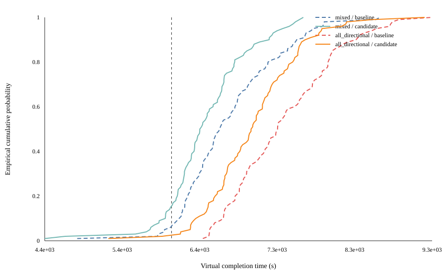
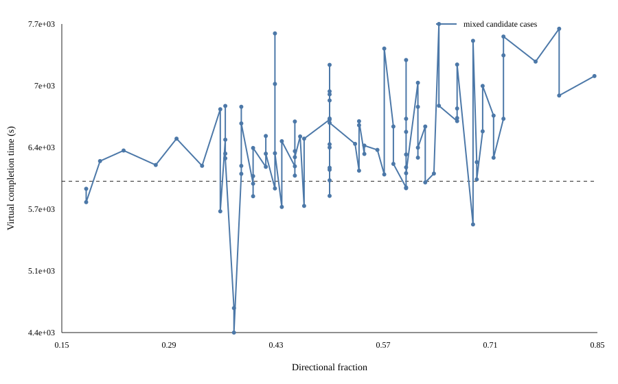
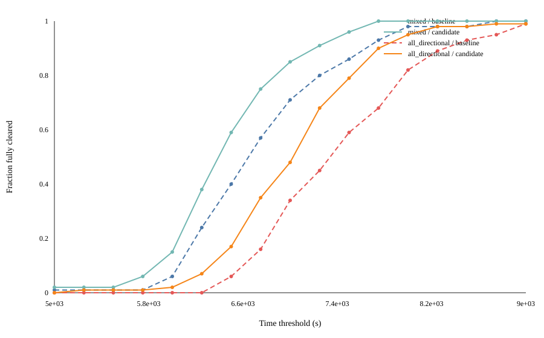
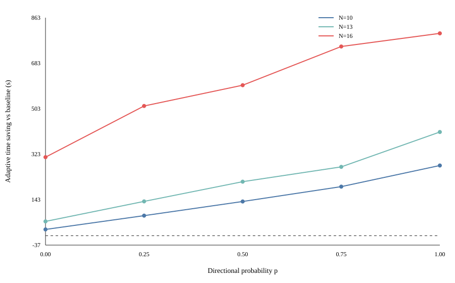
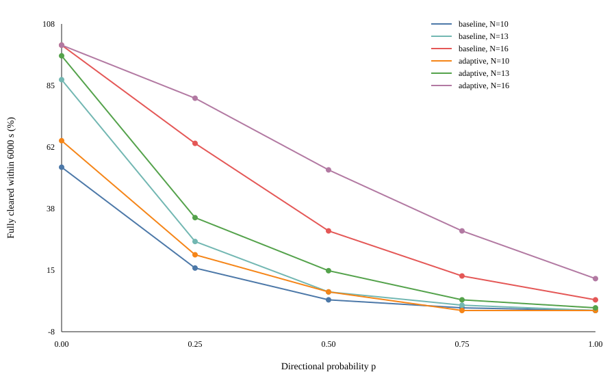

# Task 4 局部策略敏感性分析报告

日期：2026-09-13  
对象：`double_ring_optical_clear_probe`（基线）与 `adaptive_double_ring_clear_probe`（候选）  
证据：既有混合100/全定向100数据，以及新增的受控全因子本地模拟

## 摘要

本文研究 Task 4 双环策略对发射源数量和定向源比例的敏感性。分析分为两个阶段：第一阶段只使用已经存在的混合100与全定向100数据，进行分层、配对差值、成本分解、阈值曲线和重采样稳定性分析；第二阶段新增一个受控的 `3×5` 全因子实验，将发射源数设为 `N∈{10,13,16}`、定向概率设为 `p∈{0,0.25,0.5,0.75,1}`，每个格点使用100个基础实例，并对两种策略进行严格实例内配对，共得到1500个配对案例和3000次策略运行。

主要结论如下。

1. 既有数据中，adaptive 相对基线在混合100和全定向100上分别平均节省 `299.19 s` 和 `382.45 s`；配对 bootstrap 95% 区间分别为 `[-381.75,-223.02] s` 和 `[-479.22,-285.89] s`，均未跨越0。
2. 既有混合数据中，控制源数后，定向占比每增加10个百分点，候选总时间平均增加约 `182.06 s`，HC3近似95%区间为 `[93.38,270.73] s`。但这是开发集上的观察性关系，不能解释为纯因果效应。
3. 受控实验中，`p=1` 相对 `p=0` 的平均增时在所有 `N×策略` 组合上均显著为正：adaptive 在 `N=10,13,16` 时分别增加 `1098.02、1342.21、2434.10 s`。定向性造成的主要额外成本来自移动和无线测量。
4. 源数效应不是单调的。低定向比例下，16源比10源更快，因为发现全部16个频道后可停止未见频道搜索；高定向比例下，新增源的定位负担逐步抵消这一收益。`p=1` 时基线的 `N=16−N=10` 为 `+328.53 s`，而 adaptive 仍为 `−194.44 s`。
5. `N` 与 `p` 存在强交互。`p=1−p=0` 的增时从 `N=10` 到 `N=16`，基线额外扩大 `1573.04 s`，adaptive 额外扩大 `1336.07 s`，对应区间均不跨0。
6. 受控实验的15个格点全部 `100/100` 全清，两种策略共3000次运行无未清案例；但6000秒达标率对 `N` 和 `p` 很敏感，因此“可靠全清”和“6000秒内完成”必须分开评价。

结论是：**定向比例是主要敏感因素，源数通过“发现16源后停止搜索”的机制产生非单调效应，二者不可独立解释；adaptive 能稳定降低均值和尾部风险，但不能消除全定向场景的时间压力。**

## 1. 问题与证据边界

### 1.1 研究问题

本文回答四个问题：

1. 完成时间对定向源比例有多敏感？
2. 完成时间对真实发射源数有多敏感？
3. 两个因素是否存在交互？
4. adaptive 相对基线的收益是否随场景改变？

评价指标包括：最终全清率、虚拟完成时间、P95、6000秒内全清率，以及移动、测量、切频、光学操作等成本分量。

### 1.2 数据来源

第一阶段使用已经复制到 `result/task4_mixed100_vs_directional100/` 的两组数据：

- 随机混合100：seed 0–99，生成器定向概率0.5，共1274个源，其中定向663个、全向611个；
- 全定向100：seed 0–99，共1274个源，全部为定向源。

两组均包含基线和候选的逐案例数据。场景内部两策略是同实例配对；但混合组与全定向组不是严格的“只翻转类型”配对，因为原生成器的条件随机数消耗会改变后续位置、半径等属性。因此，第一阶段的跨场景差异只作为观察性证据。

第二阶段使用本文新建的受控生成器。它先为每个基础 seed 独立生成一个有序16源模板，为每个源一次性冻结：

\[
(c_j,x_j,y_j,R_j,\phi_j,u_j),\qquad j=1,\ldots,16,
\]

其中 `c` 为频道，`(x,y)` 为位置，`R` 为接收半径，`φ` 为预生成方向，`u∼U(0,1)` 为类型分数。因素水平按下式施加：

\[
\mathrm{directional}_j(p)=\mathbf 1(u_j<p).
\]

`N=10` 和 `N=13` 使用同一16源模板的前缀。因此，改变 `p` 时只改变类型；改变 `N` 时只增加模板尾部的源。此设计比原生成器更适合因果解释，但仍属于本地模拟假设，不代表官方实例分布。

## 2. 指标、模型与统计方法

### 2.1 时间成本恒等式

每局最终虚拟时间按接口成本分解为

\[
T=T_{\mathrm{move}}+T_{\mathrm{measure}}+T_{\mathrm{switch}}+
T_{\mathrm{optical}}+T_{\mathrm{clear}}.
\]

其中移动速度为5 m/s，无线测量、切频、光学检测和成功清除分别按模拟器规则计时。新增实验对3000行逐行验证该恒等式，最大绝对残差小于 `10^{-6} s`。

### 2.2 配对策略效应

在相同实例上定义

\[
\Delta T_i=T_{i,\mathrm{adaptive}}-T_{i,\mathrm{baseline}}.
\]

`ΔT<0` 表示 adaptive 更快。所有策略差、类型差和源数差都先在同一基础 seed 内求差，再以基础 seed 为重采样单元进行10000次 bootstrap，报告均值的百分位95%区间。这样避免把同一基础实例派生出的多个运行误当作独立样本。

### 2.3 观察性回归

对既有混合100数据拟合探索性模型

\[
T_i=\beta_0+\beta_1(N_i-\bar N)+
\beta_2\frac{r_i-\bar r}{0.1}+
\beta_3(N_i-\bar N)\frac{r_i-\bar r}{0.1}+\varepsilon_i,
\]

其中 `r_i` 为定向源占比。使用HC3异方差稳健标准误。该模型只用于描述开发样本，且未对多重比较校正；系数不作为官方分布下的因果结论。

### 2.4 受控全因子分解

受控设计包含3个源数水平、5个定向概率水平和100个基础 seed 区组。对每种策略分别将处理平方和分解为

\[
SS_{\mathrm{treat}}=SS_N+SS_p+SS_{N\times p}.
\]

同时将基础 seed 作为区组，以降低几何难度差异造成的噪声。本文主要报告处理平方和占比和配对效应，不用单一显著性检验替代实际效应大小。

## 3. 第一阶段：仅使用既有数据

### 3.1 总体表现

| 场景 | 策略 | 全清 | 均值 (s) | 均值bootstrap 95%区间 (s) | P95 (s) | 6000秒内全清 |
|---|---|---:|---:|---:|---:|---:|
| 混合100 | 基线 | 100/100 | 6735.71 | [6610.46,6859.59] | 7792.29 | 6/100 |
| 混合100 | adaptive | 100/100 | 6436.51 | [6328.12,6539.25] | 7406.15 | 15/100 |
| 全定向100 | 基线 | 100/100 | 7418.91 | [7291.70,7543.73] | 8592.31 | 0/100 |
| 全定向100 | adaptive | 100/100 | 7036.46 | [6920.95,7153.87] | 7909.91 | 2/100 |

两场景全部最终全清，但6000秒达标率明显不同。全定向相对混合的 seed 对齐差异为：基线 `+683.20 s`，adaptive `+599.94 s`。其bootstrap区间分别为 `[515.30,848.89] s` 和 `[442.81,759.48] s`。由于不是严格实例配对，这两个区间描述样本差异的稳定性，不代表类型翻转的纯效应。



### 3.2 定向比例分层

将混合100按定向比例分为四组。候选的均值从 `<40%` 组的 `6101.57 s` 上升到 `≥60%` 组的 `6661.68 s`，相差 `560.11 s`。对应基线从 `6359.51 s` 上升到 `6964.10 s`。Spearman秩相关为：基线 `ρ=0.416`，候选 `ρ=0.397`。

回归中，定向占比每增加10个百分点：

- 基线估计增加 `180.17 s`，HC3近似95%区间 `[81.46,278.89] s`；
- 候选估计增加 `182.06 s`，区间 `[93.38,270.73] s`；
- 候选相对基线的配对差仅改变 `+1.88 s`，区间 `[-65.29,69.05] s`。

这说明在混合样本中，定向比例明显影响绝对完成时间，但没有充分证据表明它在样本中间区间显著改变 adaptive 的平均节省量。后续受控实验覆盖完整 `p∈[0,1]` 后，会看到策略收益随 `p` 增大，说明小样本局部回归不足以描述全范围非线性。



### 3.3 源数分层与非单调性

混合样本中，候选按源数的平均时间并不随 `N` 单调增加：`N=14` 为 `6688.95 s`，而 `N=16` 降至 `5966.57 s`。配对收益在 `N=16` 达到 `−837.04 s`，显著大于其他分层。

原因不是“源越多越容易”，而是策略知道源数上限为16：发现16个不同频道后即可停止继续搜索未见频道；当真实源数小于16时，策略不能从长时间无信号推断已经清完，仍需完成发现覆盖。该机制意味着源数敏感性必须与定向比例共同分析。

### 3.4 成本分解

| 场景 | 策略变化 | 移动 (s) | 测量 (s) | 切频 (s) | 光学 (s) | 总计 (s) |
|---|---|---:|---:|---:|---:|---:|
| 混合100 | adaptive−基线 | −237.51 | −67.70 | −13.51 | +19.53 | −299.19 |
| 全定向100 | adaptive−基线 | −323.12 | −64.95 | −13.25 | +18.87 | −382.45 |

adaptive 用更多光学尝试换取较少移动、测量和切频。移动节省是总收益的最大来源。由于这些成本分量也是策略决策的结果，只能作为机制诊断，不能据相关性断言单一动作的因果贡献。

### 3.5 时间阈值敏感性

6000秒不是唯一有意义的阈值。经验达标率显示：

| 场景/策略 | ≤6000 | ≤6500 | ≤7000 | ≤7500 | ≤8000 |
|---|---:|---:|---:|---:|---:|
| 混合/基线 | 6% | 40% | 71% | 86% | 98% |
| 混合/adaptive | 15% | 59% | 85% | 96% | 100% |
| 全定向/基线 | 0% | 6% | 34% | 59% | 82% |
| 全定向/adaptive | 2% | 17% | 48% | 79% | 95% |

结论并非由6000秒单点阈值制造：adaptive 在6500–8000秒区间仍保持更高累计完成率。然而“6000秒内完成”的绝对水平仍低，尤其是全定向场景。



### 3.6 重采样稳定性

混合和全定向两组的候选−基线均值差在10000次配对bootstrap中均未跨0。逐一删除任一案例后：

- 混合组平均差范围为 `[-307.37,-285.91] s`；
- 全定向组平均差范围为 `[-400.61,-366.63] s`。

因此平均收益并非由单个极端案例驱动。不过，每个分组只有100例，P99与最大值仍主要由一两个案例决定，不宜作为稳定尾部估计。

## 4. 第二阶段：新增受控实验

### 4.1 设计与完整性

新增实验使用 seed 60000–60099。每个基础 seed 派生15个 `N×p` 场景，每个场景配对运行两策略：

\[
100\text{ seeds}\times3N\times5p\times2\text{ strategies}=3000\text{ runs}.
\]

所有3000次运行均最终全清。实际定向占比在 `p=0.25、0.5、0.75` 附近分别约为 `28.3%–28.5%、51.4%–52.0%、74.9%–75.4%`。后续以设计因子 `p` 为横轴，并在原始表中保留实际定向数量。

### 4.2 因子格点结果

下表给出候选策略的主要结果：

| N | p | 实际平均定向占比 | 均值 (s) | P95 (s) | 6000秒内全清 |
|---:|---:|---:|---:|---:|---:|
| 10 | 0 | 0.0% | 5963.50 | 6176.58 | 64% |
| 10 | 0.25 | 28.5% | 6284.99 | 6977.67 | 21% |
| 10 | 0.5 | 51.4% | 6543.55 | 7344.49 | 7% |
| 10 | 0.75 | 75.1% | 6821.00 | 7717.83 | 0% |
| 10 | 1 | 100% | 7061.53 | 7907.55 | 0% |
| 13 | 0 | 0.0% | 5772.03 | 5965.10 | 96% |
| 13 | 0.25 | 28.4% | 6179.62 | 7059.43 | 35% |
| 13 | 0.5 | 51.5% | 6514.29 | 7401.65 | 15% |
| 13 | 0.75 | 74.9% | 6831.31 | 7789.45 | 4% |
| 13 | 1 | 100% | 7114.24 | 8045.65 | 1% |
| 16 | 0 | 0.0% | 4432.99 | 5312.04 | 100% |
| 16 | 0.25 | 28.3% | 5274.63 | 6486.66 | 80% |
| 16 | 0.5 | 52.0% | 5911.11 | 7012.43 | 53% |
| 16 | 0.75 | 75.4% | 6365.14 | 7498.21 | 30% |
| 16 | 1 | 100% | 6867.09 | 8155.57 | 12% |


每个固定 `N` 下，均值随 `p` 单调上升。相邻四段 `p` 增量的配对bootstrap区间均为正，因此该趋势不是由端点少数样本造成。

### 4.3 定向概率主效应

严格冻结非类型属性后，`p=1−p=0` 的配对效应为：

| N | 基线增时 (s) | 95%区间 | adaptive增时 (s) | 95%区间 |
|---:|---:|---:|---:|---:|
| 10 | 1350.94 | [1237.34,1471.10] | 1098.02 | [998.36,1198.95] |
| 13 | 1696.11 | [1563.85,1830.41] | 1342.21 | [1236.15,1448.49] |
| 16 | 2923.98 | [2750.30,3095.40] | 2434.10 | [2264.69,2605.93] |

100个实例中，基线在所有三个 `N` 上都是每一局全定向时间大于全向时间；adaptive 在 `N=10、13` 时也是100/100，在 `N=16` 时为99/100。由此可确认定向性具有稳定且量级较大的不利效应。

成本分解显示，移动增量占总增时的约65%–74%，无线测量约24%–30%，切频约4%–6%；光学时间差接近0或略有下降。因此优化全定向性能的首要对象仍应是减少重定位移动和无效测量，而不是压缩单次光学成本。

### 4.4 源数效应及机制

`N=16−N=10` 的配对差如下：

| p | 基线差值 (s) | adaptive差值 (s) |
|---:|---:|---:|
| 0 | −1244.51 | −1530.51 |
| 0.25 | −576.47 | −1010.37 |
| 0.5 | −172.29 | −632.45 |
| 0.75 | +98.79，区间跨0 | −455.86 |
| 1 | +328.53 | −194.44 |

低 `p` 时，增加到16源显著缩短总时间。这一结果看似反常，但与停止规则一致：16源全部出现后，可证明不存在更多源；10源场景必须继续完成覆盖搜索。候选在 `N=10,p=0` 下末次清除后仍平均运行 `454.91 s`，而 `N=16` 时该量为0。

随着 `p` 增大，16源带来的额外定位成本上升。基线在 `p≈0.75` 附近由“16源更快”转为差异不清晰，并在 `p=1` 时变成16源显著更慢。adaptive 的发现16源收尾机制更强，在全部五个 `p` 水平下仍保持16源平均更快，但 `p=1` 时优势已缩小到 `194.44 s`。

因此，不能用单一的“每增加一个源增加多少秒”描述本问题。源数既增加任务负担，也增加达到已知上限、提前结束未知频道搜索的机会。

### 4.5 交互效应

使用差中差

\[
I=\big[T(16,1)-T(16,0)\big]-
\big[T(10,1)-T(10,0)\big]
\]

衡量定向效应是否随源数变化。结果为：

- 基线：`I=1573.04 s`，95%区间 `[1420.76,1720.77] s`；
- adaptive：`I=1336.07 s`，95%区间 `[1191.17,1474.91] s`。

两者均显著为正，说明16源场景对定向性的敏感程度远高于10源场景。受控平方和分解也支持这一点：

| 策略 | `p`占处理平方和 | `N`占比 | `N×p`占比 |
|---|---:|---:|---:|
| 基线 | 85.73% | 4.16% | 10.11% |
| adaptive | 66.61% | 24.99% | 8.41% |

这里的占比描述当前离散设计范围内的相对敏感程度，不应外推为任意官方分布下的方差贡献。

### 4.6 策略收益对场景的敏感性

adaptive 在15个格点上的平均时间均低于基线，而且每格的配对bootstrap 95%区间都严格低于0。收益随 `N` 和 `p` 增大：

- `N=10`：从 `p=0` 的 `24.94 s` 增至 `p=1` 的 `277.86 s`；
- `N=13`：从 `56.63 s` 增至 `410.53 s`；
- `N=16`：从 `310.95 s` 增至 `800.83 s`。



平均收益稳定不等于逐局占优。例如 `N=10,p=0` 仅56%的实例中 adaptive 更快；在 `N=16,p=1` 时则有88%更快。故论文中应同时报告均值差、配对区间和逐局胜率。

### 4.7 6000秒目标的敏感性



候选在 `N=16` 下的6000秒达标率随 `p` 从0增加到1依次为 `100%、80%、53%、30%、12%`；在 `N=10` 下为 `64%、21%、7%、0%、0%`。这再次表明：

- 最终全清率在本实验中不敏感，全部为100%；
- 6000秒内全清率高度敏感；
- 不能只报告最终全清率来支持时间目标。

## 5. 验证、局限与可复现性

### 5.1 验证

- 既有数据：4个策略/场景组合均为100行，场景内部 seed 一一配对。
- 受控数据：应有且实际有3000行、3000个唯一 `(N,p,strategy,seed)` 键。
- 全清检查：3000/3000。
- 成本恒等式：最大绝对残差小于 `10^{-6} s`。
- 重采样：固定随机种子，10000次，以基础 seed 为单位。
- 策略实现：运行前在 `design.json` 中记录两份策略源文件和实验脚本的SHA-256。
- 回归测试：`python3 -B -m unittest discover -s task4/tests -v` 在允许本地回环套接字的环境中 `53/53` 通过。沙箱内首次运行的4项HTTP测试仅因禁止创建本地套接字而报权限错误，其余49项已通过。

### 5.2 局限

1. 所有结果来自本地模拟器，位置、半径、类型分布是假设，而非官方分布证据。
2. 既有100+100属于开发数据，观察性回归可能受到调参选择和小样本影响。
3. 新实验冻结属性以识别因素效应，但使用了与原生成器不同的“先生成全部潜变量、再施加因素”顺序；它提高了内部效度，不提高外部效度。
4. `p` 是生成阈值，有限样本中的实际定向占比不严格等于 `p`。
5. 受控设计只取 `N=10,13,16` 三点和五个 `p` 水平；不能证明中间所有水平完全平滑。
6. 所有运行均全清，无法从零失败样本证明最坏情况下不会失败；100例零失败的单侧95%失败率上界仍约为2.95%。
7. 时间P95每格仅由100例估计，精度弱于均值；报告未将P99作为核心结论。

### 5.3 复现命令

在仓库根目录执行：

```bash
python3 -B result/task4_sensitivity_analysis/scripts/analyze_existing.py

python3 -B result/task4_sensitivity_analysis/scripts/run_controlled_experiment.py \
  --output-dir result/task4_sensitivity_analysis/controlled_experiment_reproduction \
  --seed-start 60000 --replicates 100 --workers 4

python3 -B result/task4_sensitivity_analysis/scripts/analyze_controlled.py \
  --experiment-dir result/task4_sensitivity_analysis/controlled_experiment_reproduction
```

若省略 `--experiment-dir`，第三条命令默认重新分析已归档的正式数据。全部脚本只使用Python标准库。

主要数据文件：

- [既有数据总体汇总](data_only/tables/scenario_summary.csv)
- [既有数据配对稳定性](data_only/tables/bootstrap_and_leave_one_out.csv)
- [既有数据探索性回归](data_only/tables/exploratory_hc3_regression.csv)
- [受控实验设计](controlled_experiment/design.json)
- [受控实验逐运行原始数据](controlled_experiment/raw_cases.csv)
- [15个因子格点汇总](controlled_experiment/tables/factor_cell_summary.csv)
- [策略配对效应](controlled_experiment/tables/strategy_effect_by_cell.csv)
- [全定向相对全向效应](controlled_experiment/tables/directional_effect_p1_minus_p0.csv)
- [16源相对10源效应](controlled_experiment/tables/emitter_count_effect_n16_minus_n10.csv)
- [交互对比](controlled_experiment/tables/count_direction_interaction_contrast.csv)

## 6. 结论与建模建议

在当前本地证据范围内，可形成以下建模结论：

1. 应将定向比例作为 Task 4 性能模型的核心不确定因素；它对总时间的影响稳定、幅度大，并主要通过移动和无线测量成本体现。
2. 源数不能作为独立线性负担项。应显式加入“是否达到已知上限16”的状态变量，或使用 `N×p` 交互项。
3. adaptive 的主要价值是降低困难场景中的移动和测量负担；其优势在高 `N`、高 `p` 时最大。
4. 评价体系必须同时包含最终全清率、完成时间分布和阈值达标率。当前结果支持“可靠完成”，不支持“普遍6000秒完成”。
5. 下一步优化应优先针对高定向比例下的重定位路线、可见性约束补测和无效测量，而不是进一步压缩光学操作本身。

最终证据链为：

`既有逐案例数据 → 观察性分层与配对分析 → 识别混杂边界 → 冻结实例属性的全因子实验 → 区组配对重采样 → 敏感性与交互结论`。
