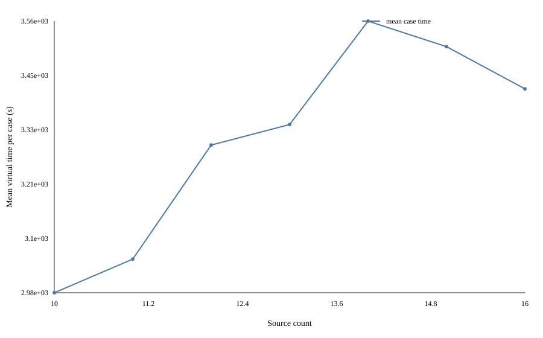
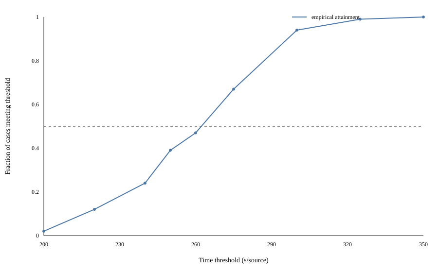

# Task 3 敏感性分析报告

日期：2026-09-13  
对象：`candidate_057_posterior_free`  
主数据：100 场随机源数并发压力测试（seed `20261310`--`20261409`）  
新增模拟：330次正式筛选运行；另有90次不重复计入统计的确定性复现

## 摘要

本报告参考 Task 4 的敏感性分析框架，将“已有数据可回答的问题”和“必须重新运行模拟器的问题”分开。现有数据部分完成了源数分层、场景特征关联、时间成本分解、阈值曲线、bootstrap/逐一删除稳定性、冻结轨迹成本反事实，以及已有配对候选和局部机制分析。

主要结果如下。

1. 100 场、1291 个源全部清除；汇总口径为 `256.01 s/源`，按案例重采样的 bootstrap 95% 区间为 `[250.05, 262.03] s/源`。逐一删除任一案例后，该指标只在 `[255.41, 256.88] s/源` 内变化，整体均值不是由单个极端案例驱动。
2. 总用时随源数总体上升，但单位源用时随源数明显下降：`N=10` 为 `298.35 s/源`，`N=16` 为 `213.55 s/源`。`N=16` 达到已知源数上限后可以提前停止未知频道搜索，因此源数不是简单的线性负担变量。
3. 移动占总虚拟时间 `76.15%`，测量占 `18.33%`，其余切频、光学和激光合计仅 `5.52%`。冻结既有路线时，速度提高10%可将汇总指标从 `256.01` 降至 `238.28 s/源`；测量时长降低10%只能降至 `251.31 s/源`。这说明移动仍是首要成本来源，但冻结轨迹重算不是策略重新决策后的因果实验。
4. 探索性 HC3 回归中，在同时控制源数和所选几何特征后，平均最近邻距离每增加100 m，与总时间增加 `137.96 s`（近似95%区间 `[87.59,188.33]`）相关；平均径向距离每增加100 m，与总时间增加 `32.96 s`（`[2.62,63.29]`）相关。接收半径均值的区间跨0，现有观察样本不足以证明算法对接收半径不敏感。
5. `220 s/源` 仅有 `12/100` 场达到；`250、275、300 s/源` 的经验达标率分别为 `39%、67%、94%`。因此总体均值没有掩盖“多数场景尚未达到220”的事实。
6. 已有30场严格同场景配对中，057 相对041减少 `26.74 s/源`，bootstrap 95%区间为 `[21.20,32.44] s/源` 的节省，且30场全部改善。这是整个机制包的效果，不能拆成单一参数贡献。
7. 仅5场的开发期局部对比显示，posterior completion 在 free-order 背景下平均节省 `2.43 s/源`，但在 fixed-order 背景下接近0；probe budget 的效果也随路线背景改变。样本太小，只能作为交互线索，不能作为参数定型证据。
8. 新增P1筛选中，`grid_step_m=2.5` 相对5 m平均劣化 `57.58 s/源`，12场中仅1场改善；10 m相对5 m为 `+2.23 s/源`，区间跨0。其余开关在这12场中没有触发路径差异，不能据“零差”宣称全局不敏感。
9. 新增P2 L9正交筛选中，方位误差界从0.5°增加到1.5°平均增加 `12.89 s/源`；接收半径带从 `[975,1475]` 提高到 `[1100,1600] m` 的差为 `-1.17 s/源`，区间跨0。
10. 新增P3压力筛选中，边界密集是主要困难模式；聚类和近重合源对反而因空间集中而缩短路线。全部330次正式运行均严格全清，0异常。

结论是：**当前策略对移动距离和“源数是否达到已知上限”最敏感；场景空间分散度可能是主要困难因子；接收半径、误差界和内部规划参数的真正响应敏感性仍需要受控重跑。**

## 1. 分析内容与证据边界

### 1.1 已完成内容

- 数据完整性、全清与虚拟时间恒等式检查；
- 汇总单位源用时的整案例 bootstrap 与 leave-one-out；
- `N=10,...,16` 的分层均值、P95、成本和诊断事件；
- 从冻结真值计算径向位置、接收半径、角间隙、质心偏移和最近邻距离；
- Spearman 秩相关及探索性 HC3 回归；
- 虚拟时间各成本分量和局部成本弹性；
- 单位源时间和总时间的阈值敏感性；
- 在不改变动作序列的前提下，对速度及接口时长做反事实重算；
- 已有30场041/057严格配对，以及已有5场局部机制配对。

### 1.2 新增实验范围

在用户要求的半小时上限内，新增实验改用筛选设计：P1为11配置×12共同场景，P2为L9正交表×12 seed区组，P3为5空间模式×3源数×6区组，共330次正式运行。正式批次墙钟432.74秒。另一次90运行P3复现与正式P3逐项一致，但不重复计入统计。

筛选样本用于发现大效应、无效参数和失败模式，不等同于原设计每格100场的确认性实验。100场历史主数据以100 workers在32逻辑核机器上运行；并发竞争影响算法墙钟时间，因此跨批次只比较虚拟时间，不比较每场墙钟。

## 2. 方法

### 2.1 主要评价量

跨不同源数案例的主要指标采用加权汇总：

\[
\bar t_{\rm source}=\frac{\sum_i T_i}{\sum_i N_i},
\]

而不是先计算每场 `T_i/N_i` 再等权平均。bootstrap 以完整案例为重采样单元，同时重采样该案例的 `T_i` 与 `N_i`。

### 2.2 时间分解和冻结轨迹反事实

每场均验证

\[
T=T_{\rm move}+T_{\rm measure}+T_{\rm switch}+T_{\rm optical}+T_{\rm laser}.
\]

对某个接口成本乘以系数 `k` 时，只替换对应已发生成本。例如速度乘以 `k` 时，固定路径的移动时间除以 `k`。这给出“相同动作和路线”的会计反事实，不能包含策略因参数变化而重新规划产生的二阶效应。

### 2.3 场景特征分析

每场从源真值派生：平均/最大径向距离、外圈源比例、接收半径统计量、最大极角空隙、源质心偏移、最近邻距离。报告 Spearman 相关，并拟合：

\[
T_i=\beta_0+\beta_NN_i+\beta_r\bar r_i+\beta_R\bar R_i+
\beta_g g_i+\beta_d\bar d_i+\varepsilon_i,
\]

使用 HC3 异方差稳健标准误。位置、半径和源数来自同一随机生成过程，且模型形式是在看到数据后确定，因此系数只描述本样本关联，不作因果解释，也未作多重比较校正。

## 3. 现有100场的敏感性结果

### 3.1 总体稳定性

| 指标 | 结果 |
|---|---:|
| 完整案例 | 100/100 |
| 全清案例 | 100/100 |
| 清除源 | 1291/1291 |
| 汇总单位源用时 | 256.01 s/源 |
| Bootstrap 95%区间 | [250.05,262.03] s/源 |
| Leave-one-out范围 | [255.41,256.88] s/源 |
| 平均每场时间 | 3305.03 s |
| P95每场时间 | 3703.95 s |
| 最大每场时间 | 3999.60 s |

100次零失败不能证明失败概率为0。按 rule of three，单侧95%失败率粗略上界约为3%。

### 3.2 源数敏感性

| 源数 | 案例数 | 平均每场时间 (s) | P95 (s) | 平均单位源时间 (s/源) |
|---:|---:|---:|---:|---:|
| 10 | 14 | 2983.52 | 3242.26 | 298.35 |
| 11 | 13 | 3054.90 | 3205.63 | 277.72 |
| 12 | 19 | 3297.36 | 3589.72 | 274.78 |
| 13 | 15 | 3341.01 | 3571.06 | 257.00 |
| 14 | 14 | 3560.69 | 3907.72 | 254.33 |
| 15 | 11 | 3506.38 | 3717.90 | 233.76 |
| 16 | 14 | 3416.77 | 3726.74 | 213.55 |

总时间与源数 Spearman `rho=+0.656`，单位源时间与源数 `rho=-0.854`。两者并不矛盾：更多源增加绝对工作量，但固定覆盖搜索成本被更多源分摊；特别是发现16个频道后，`focus_after_upper_bound_discovered` 允许停止未见频道搜索。不能将观察到的每源下降外推为“增加源会改善系统”。



### 3.3 成本分解

| 成本 | 平均每场 (s) | 总时间占比 |
|---|---:|---:|
| 移动 | 2516.67 | 76.15% |
| 无线测量 | 605.70 | 18.33% |
| 切频 | 110.85 | 3.35% |
| 光学 | 45.99 | 1.39% |
| 激光 | 25.82 | 0.78% |

在冻结轨迹的局部意义下，各成本系数的弹性等于其时间份额；速度弹性符号相反且因 `T_move/v` 略非线性。因此，优先缩短路线比压缩光学或激光接口时间更可能产生数量级明显的收益。

| 输入变化 | 冻结轨迹单位源用时 | 相对基准变化 |
|---|---:|---:|
| 速度 -10% | 277.66 | +21.66 |
| 速度 +10% | 238.28 | -17.72 |
| 速度 +20% | 223.52 | -32.49 |
| 测量时长 -10% | 251.31 | -4.69 |
| 测量时长 +10% | 260.70 | +4.69 |

即使固定路线下速度提高20%，汇总值仍为 `223.52 s/源`，略高于220。这个结果不能用于建议改变题面速度，只用于识别成本主导项。


### 3.4 场景空间特征

HC3 回归对总用时的主要系数为：

| 因素变化 | 总用时关联 (s) | 近似95%区间 |
|---|---:|---:|
| 源数 +1 | +111.97 | [89.73,134.20] |
| 平均径向距离 +100 m | +32.96 | [2.62,63.29] |
| 平均接收半径 +100 m | -11.50 | [-112.36,89.37] |
| 最大角间隙 +10° | +14.90 | [-3.39,33.19] |
| 平均最近邻距离 +100 m | +137.96 | [87.59,188.33] |

单位源模型中，源数系数为 `-10.85 s/源`，平均最近邻距离系数为 `+10.65 s/源/100 m`，平均径向距离为 `+2.66 s/源/100 m`。这支持“空间分散提高路线成本”的机制解释，但随机场景中各空间指标彼此相关，不能据此断言单独移动某个源必然造成相同变化。

接收半径均值的简单秩相关和控制后区间均未显示清晰关系。这不等于算法对接收半径稳健：现有半径都来自同一 `[1000,1500] m` 分布，且没有冻结位置后只改变半径，受控半径实验仍然必要。

### 3.5 目标阈值敏感性

| 阈值 (s/源) | 达标案例 |
|---:|---:|
| 200 | 2/100 |
| 220 | 12/100 |
| 240 | 24/100 |
| 250 | 39/100 |
| 260 | 47/100 |
| 275 | 67/100 |
| 300 | 94/100 |
| 325 | 99/100 |
| 350 | 100/100 |



`220 s/源` 的低达标率主要不能用一个全样本均值表达。由于每场源数不同，单位源阈值具有“固定搜索成本被源数分摊”的结构效应；论文应同时报告总时间、源数分层和汇总单位源口径。

## 4. 已有配对与局部机制证据

### 4.1 041 到 057 的完整机制包

在 seeds `20261210`--`20261239` 的30个相同真值场景中：

- 057 相对041平均减少 `26.74 s/源`；
- bootstrap 95%节省区间为 `[21.20,32.44] s/源`；
- 平均每场减少 `353.01 s`；
- 30/30场改善，最大回退为0。

这证明该30场中整个057机制包的改进稳定，但041到057同时改变多个机制，不能把全部收益归因于 posterior 或 free ordering 中任一个。

### 4.2 五场开发期局部对比

| 对比（后者减前者） | 单位源变化 | 95% bootstrap区间 | 更快场数 |
|---|---:|---:|---:|
| probe 24−0，fixed-order | -0.45 | [-0.72,-0.08] | 4/5 |
| probe 24−0，free-order | +0.04 | [-0.28,+0.45] | 4/5 |
| posterior on−off，fixed-order | -0.05 | [-0.53,+0.37] | 2/5 |
| posterior on−off，free-order | -2.43 | [-5.41,-0.50] | 5/5 |

这些比较使用相同5个场景，但它们是调参开发数据，bootstrap 只有5个独立重采样单元。区间的离散性很强，也没有多重比较校正。它们最多说明 posterior 与路线背景可能交互、probe 的边际收益可能已饱和；不能据此冻结预算或宣称显著性。

## 5. 新增受控筛选实验

完整设计和原始配置见 [DESIGN.md](DESIGN.md) 与 [design.json](screening_experiment/design.json)。330/330次均严格清除全部真值源，控制器报告与模拟器真值一致，且没有运行异常。

### 5.1 P1：策略参数与机制

所有配置在相同12个随机场景内与默认057配对。

| 配置相对默认 | 平均变化 (s/源) | Bootstrap 95%区间 | 改善场数 |
|---|---:|---:|---:|
| grid 2.5 m | +57.58 | [39.08,75.60] | 1/12 |
| grid 10 m | +2.23 | [-1.95,6.17] | 5/12 |
| completion samples 15 | 0.00 | [0,0] | 0/12 |
| posterior off | 0.00 | [0,0] | 0/12 |
| free order off | 0.00 | [0,0] | 0/12 |
| shared stops off | 0.00 | [0,0] | 0/12 |
| probe budget 0/48、probe limit 0/3 | 0.00 | [0,0] | 0/12 |

2.5 m网格不是“越细越好”：它改变硬集合和后续路线决策，平均每场增加797.55秒，最坏回退1688.47秒。10 m没有清晰改善或劣化证据。

多个机制开关完全同轨迹，是因为筛选seed中相关分支没有被激活；所有P1场景的bounded en-route probe尝试数为0。`completion_sample_count` 已在 completion planner 中接线，但这12场中把上限从5提高到15没有改变被选动作，可能是候选数未超过原上限，或排序结果未改变。零差应解释为“本批次未激活或决策不变”，而不是全局稳健性。

### 5.2 P2：L9物理与源数主效应

L9设计使源数、误差界和接收半径三个三水平因素边际平衡；每格12个seed区组。它能估计主效应，但主效应与未建模交互仍可能混淆。

| 因素水平 | 汇总用时 (s/源) | 平均每场 (s) |
|---|---:|---:|
| N=10 | 330.07 | 3300.74 |
| N=13 | 272.74 | 3545.65 |
| N=16 | 238.07 | 3809.10 |
| error=0.5° | 268.51 | 3490.68 |
| error=1.0° | 269.51 | 3503.65 |
| error=1.5° | 281.63 | 3661.17 |
| reception=[975,1475] m | 272.75 | 3545.74 |
| reception=[1000,1500] m | 276.70 | 3597.13 |
| reception=[1100,1600] m | 270.20 | 3512.64 |

极端水平区组对比为：`N=16−N=10` 总时间 `+508.36 s`、单位源时间 `-92.01 s/源`；`1.5°−0.5°` 为 `+170.49 s/场`、`+12.89 s/源`，两种bootstrap区间均不跨0；高接收带减低接收带为 `-1.17 s/源`，区间 `[-6.06,4.04]`，没有清晰方向。

低接收档设为975 m而不是900 m，因为当前七点布局最坏覆盖距离约968.90 m；900 m会使保证证书在控制器初始化时失效，测试的只是非法配置拒绝，而非策略敏感性。

### 5.3 P3：空间压力模式

每个空间模式和源数组合有6个共同seed；以下为相对面积均匀场景的配对总时间变化：

| 模式 | N=10 | N=13 | N=16 |
|---|---:|---:|---:|
| 边界密集 | +465.82 | +377.68 | +261.76 s |
| 聚类 | -455.54 | -629.94 | -982.60 s |
| 大角空隙 | -9.57 | +35.08 | -35.44 s |
| 近重合源对 | -430.98 | -528.29 | -437.93 s |

边界密集在N=10和13的6/6场均更慢，额外成本主要来自移动；N=16为4/6更慢且区间跨0。聚类在全部18个比较中均更快。近重合源并未制造定位失败，反而允许共享路线；大角空隙没有稳定方向。由于每格只有6例，P3区间用于压力筛查，不应作为尾部概率估计。

## 6. 可复现性与产物

从仓库根目录运行：

```bash
python3 -B results/task3_sensitivity_analysis/scripts/analyze_existing.py

task2/.venv/bin/python -B results/task3_sensitivity_analysis/scripts/run_screening_experiments.py \
  --output-dir results/task3_sensitivity_analysis/screening_experiment_reproduction \
  --replicates 12 --workers 30

python3 -B results/task3_sensitivity_analysis/scripts/analyze_screening.py
```

脚本仅使用 Python 标准库，并会重新校验输入行数、seed/policy键、同场景配对真值和时间成本恒等式。主要产物：

- [总体汇总](data_only/tables/overall_summary.csv)
- [源数分层](data_only/tables/source_count_summary.csv)
- [逐场派生特征](data_only/tables/scenario_features.csv)
- [成本分解](data_only/tables/cost_decomposition.csv)
- [冻结轨迹成本敏感性](data_only/tables/frozen_trajectory_cost_sensitivity.csv)
- [阈值敏感性](data_only/tables/threshold_sensitivity.csv)
- [Spearman相关](data_only/tables/spearman_correlations.csv)
- [探索性HC3回归](data_only/tables/exploratory_hc3_regression.csv)
- [已有配对机制效应](data_only/tables/existing_paired_mechanism_effects.csv)
- [分析元数据](data_only/analysis_metadata.json)
- [新增实验原始逐运行数据](screening_experiment/raw_runs.csv)
- [P1配置汇总](screening_experiment/tables/p1_configuration_summary.csv)
- [P1配对效应](screening_experiment/tables/p1_paired_effects_vs_default.csv)
- [P2因子水平均值](screening_experiment/tables/p2_l9_factor_level_summary.csv)
- [P2极端水平对比](screening_experiment/tables/p2_l9_extreme_level_contrasts.csv)
- [P3空间场景汇总](screening_experiment/tables/p3_spatial_cell_summary.csv)
- [P3相对面积均匀配对效应](screening_experiment/tables/p3_paired_effects_vs_area_uniform.csv)
- [新增实验分析元数据](screening_experiment/analysis_metadata.json)

本阶段的证据链为：

`已有原始日志 → 观察性与冻结轨迹分析 → 时间受限正交/配对筛选 → 严格全清和确定性复现 → 区分大效应、未激活机制与仍需确认的交互`。
