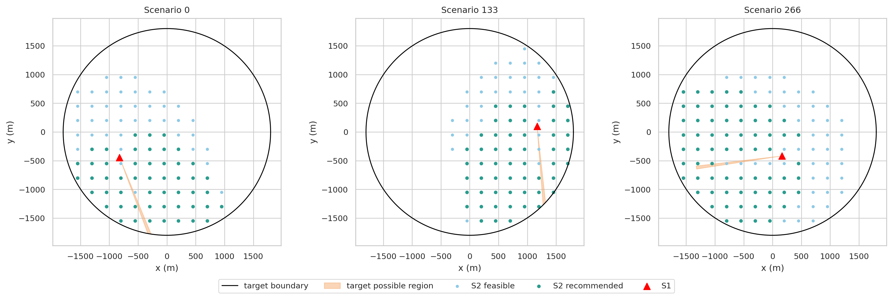
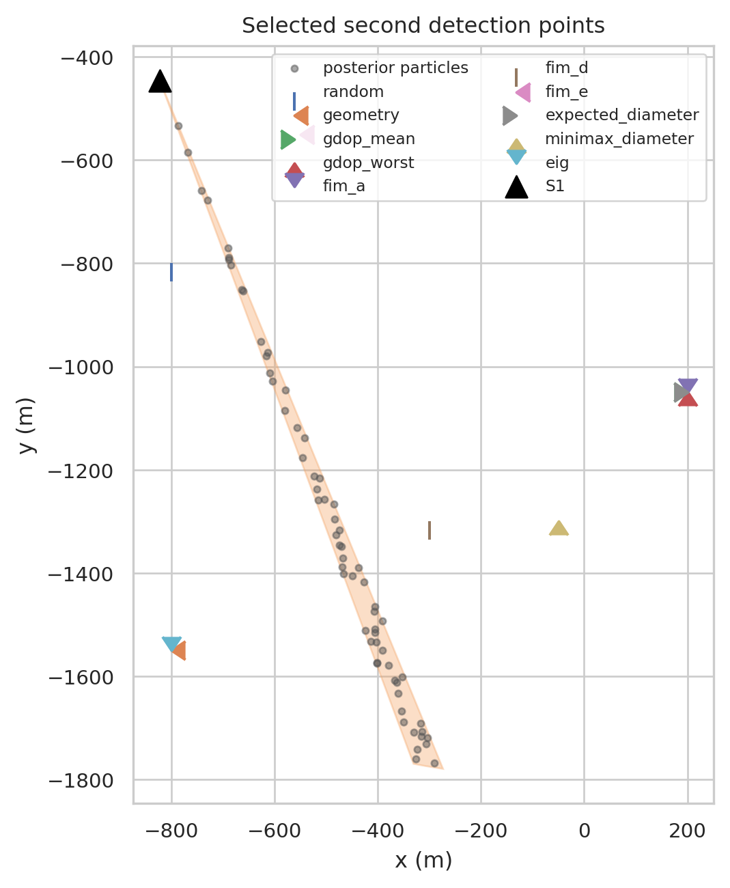
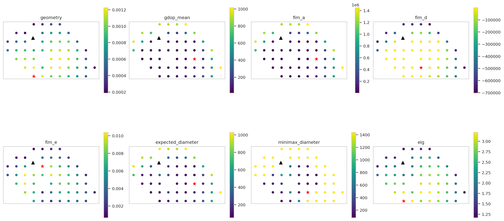
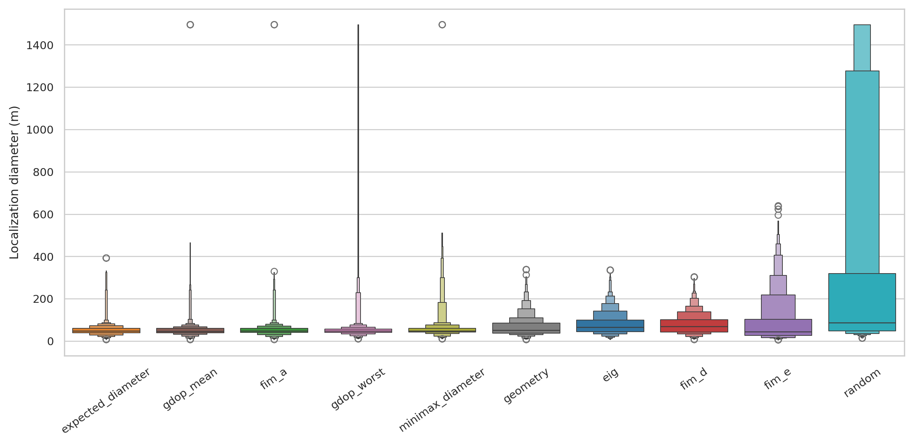
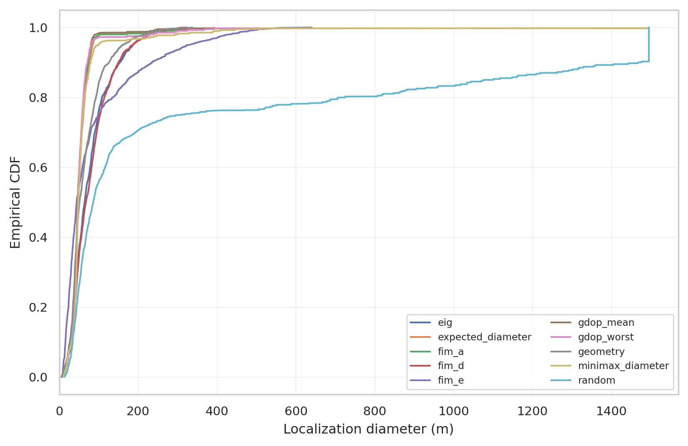
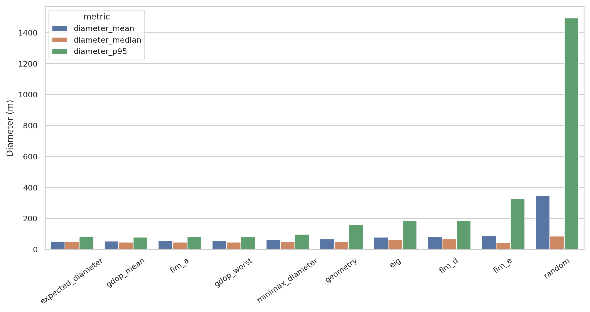
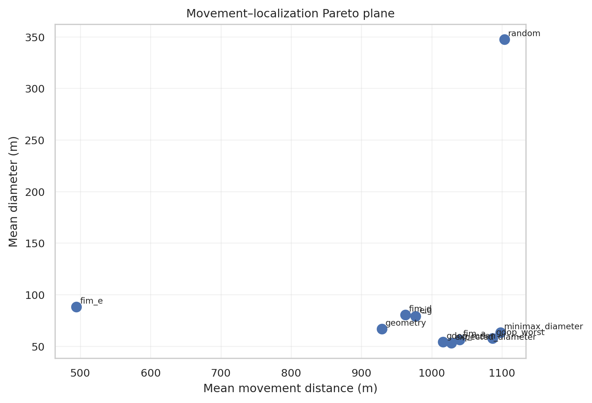
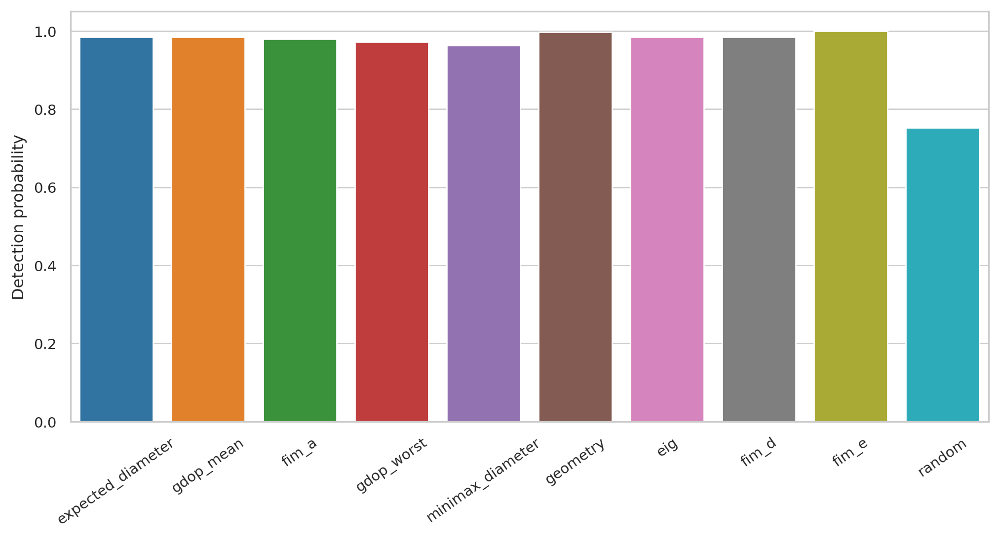
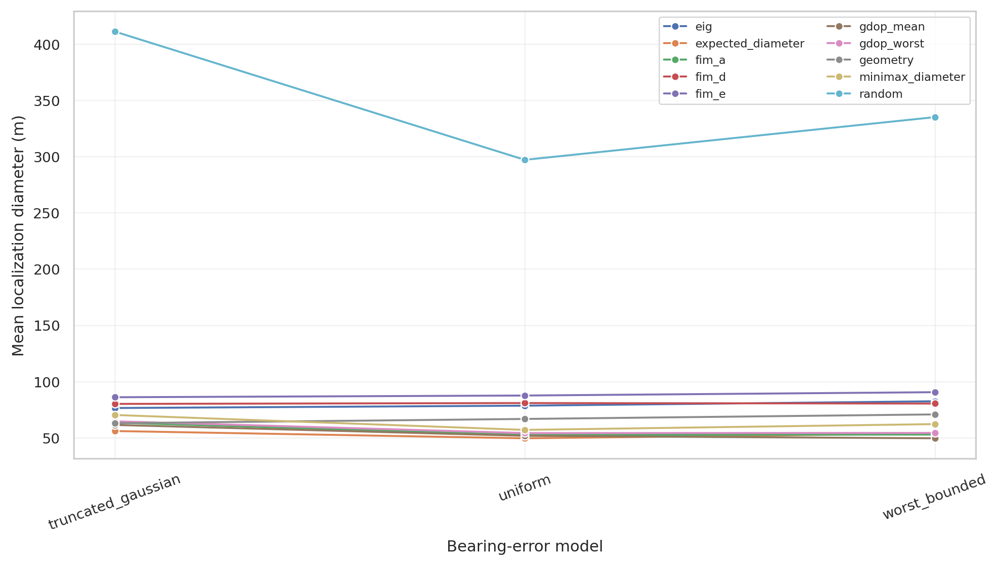
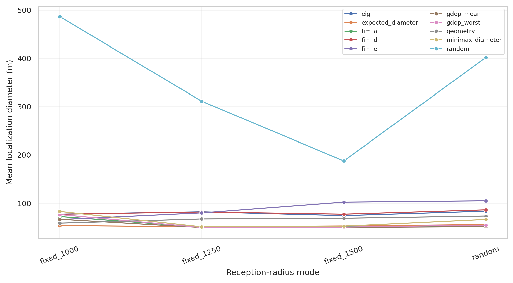

# 问题 2 报告草稿：全向干扰源第二检测点选择

## 摘要

本文在题面给出的 **±1° 硬误差界** 下，先用集合交会而非概率椭圆定义定位区域；
再分别建立几何、GDOP、Fisher 信息、期望/最坏定位区域直径和贝叶斯信息增益
等十种第二检测点策略。为了不混淆概念，本文依次定义目标可能区域
\(\mathcal F_1\)、第二点可行区域 \(\mathcal C_f\)、推荐候选区域
\(\mathcal C_r\) 和策略最终点 \(S_2^*\)。统一实验包含 400 个基础几何状态，
每个状态复现 25 次第二观测，共 10,000 个有效观测场景和 100,000 条策略评价。

实验中，最小期望定位区域直径法取得最小平均直径 53.01 m；GDOP-mean 的
median/P95 分别为 46.38/79.67 m，略优于前者的 48.07/84.81 m；纯几何法以
0.0025 s 的平均选点时间取得 99.75% 检测率；E-optimal 的平均移动距离仅
494.42 m 且检测率 100%，但 P95 恶化到 328.16 m。因此，若问题 2 只强调定位
效果，推荐最小期望直径法；若问题 3 更重视总时间，则推荐把 E-optimal 或纯几何
点作为快速候选，并在直径与移动时间之间作显式加权，而不是照搬问题 2 的单目标点。

## 1. 问题分析与证据标签

全文使用以下标签，避免把来源不同的结论混写：

- **[题面]**：题目或附件明确给出的条件；
- **[假设]**：为形成概率模型或限制搜索而增加的假设；
- **[文献]**：已有工作的通用理论；
- **[推导]**：本项目从题面与数学模型自行推出；
- **[实验]**：仅由本次固定随机种子仿真支持的观察。

**[题面]** 目标区域为半径 1800 m 的圆；全向干扰源有效接收半径
\(R\in[1000,1500]\) m；正常示向误差满足 \(|e|\le1^\circ\)；距离不超过
5 m 时无示向度但可直接光学定位；机器狗速度为 5 m/s。

**[推导]** 一次正常示向把二维目标圆缩成一个窄扇环；第二点既要有较高接收
可能性，也要与第一次视线形成非退化交会角。单纯追求 90°、单纯追求近距离、
单纯追求检测率或单纯追求移动距离都可能牺牲另一项指标，因此需要统一仿真比较。

## 2. 符号

| 符号 | 含义 |
|---|---|
| \(O=(0,0)\), \(\Omega=B(O,1800)\) | 目标圆心与目标区域 |
| \(G=(x,y)\) | 干扰源真实位置 |
| \(S_i\) | 第 \(i\) 个检测点 |
| \(\theta_i\) | 第 \(i\) 次示向度 |
| \(\beta(S,G)=\operatorname{atan2}(G_y-S_y,G_x-S_x)\) | 真实方位角 |
| \(\delta=1^\circ=\pi/180\) | 示向误差硬上界 |
| \(R\in[1000,1500]\) | 未知有效接收半径 |
| \(\operatorname{adiff}(a,b)\) | 归一到 \([-\pi,\pi)\) 的角差 |
| \(D(A)=\max_{p,q\in A}\|p-q\|\) | 问题 1 的区域直径 |

## 3. 第一次检测后的基本区域

对一次返回正常示向度的检测，定义有界测向扇区

\[
W(S,\theta;r_-,r_+)=\{g:\ r_-<\|g-S\|\le r_+,
|\operatorname{adiff}(\beta(S,g),\theta)|\le\delta\}.
\]

**[推导]** 因为第一次获得了正常示向而非 `near` 或 `no_signal`，必有
\(5<\|G-S_1\|\le R\)。个体的 \(R\) 未知时，用题面上界形成保证包含真值的
保守区域：

\[
\boxed{\mathcal F_1=\Omega\cap W(S_1,\theta_1;5,1500)}.
\]

若后续有办法标定该干扰源的 \(R\)，只需把 1500 换成已知值。程序把圆弧和
扇区多边形化后求交；定位区域直径由其凸包顶点最远点对给出。圆盘约束、5 m
内孔和接收上界都进入真实集合运算，而不是只在图上显示。

## 4. 第二检测点区域的四层定义

### 4.1 目标可能区域

\(\mathcal F_1\) 是 **干扰源位置集合**，不是机器狗的下一步行动区域。

### 4.2 第二检测点可行区域

理论上，只要某个第一次可行目标在最大接收半径内，第二点就不是“必然收不到”：

\[
\mathcal C_f^{\rm theory}=\{s\in\mathbb R^2:
\min_{g\in\mathcal F_1}\|s-g\|\le1500\}
=\mathcal F_1\oplus B(0,1500).
\]

**[假设]** 正式搜索把行动点限制在 \(\Omega\) 内。附件允许走到圆外，因此这不是
题面硬限制；采用它是因为 \(S_1,G\in\Omega\)，圆外点通常增加移动并降低接收率，
且会显著扩大网格。于是代码中的基础可行域为
\(\mathcal C_f=\mathcal C_f^{\rm theory}\cap\Omega\)。圆外大基线是否带来净收益
留作扩展敏感性分析。

### 4.3 推荐候选区域

**[假设]** 为计算概率型筛选，给 \(\mathcal F_1\) 内位置均匀面积先验；在给定
位置 \(g\) 后，因第一次已经接收，令

\[
R\mid g,Y_1\sim U(\max\{1000,\|g-S_1\|\},1500).
\]

用 64 个区域内均匀粒子近似该联合分布。对网格点 \(s\) 计算

\[
p_{\rm det}(s)=P(\|G-s\|\le R\mid Y_1),\qquad
q(s)=\operatorname{median}_{G}\{|\sin\alpha(S_1,s;G)|\},
\]

其中 \(\alpha\) 是两条视线的锐交会角。推荐域采用

\[
\mathcal C_r=\{s\in\mathcal C_f:p_{\rm det}(s)\ge0.25,
q(s)\ge0.12\},
\]

并保留有非零 `near` 概率的点。0.25 和 0.12（约对应 6.9°）是可调筛选阈值，
不是题面常数。它们分别剔除“几乎收不到”和“普遍近平行”的明显劣点。

### 4.4 最终第二检测点

每种策略只在完全相同的离散 \(\mathcal C_r\) 上优化，所得单点才记为
\(S_2^*\)。图中的扇区、蓝点、绿点和星形点分别对应目标可能区域、基础可行点、
推荐候选点和各策略最终点，不能互换。

## 5. 十种选点策略

### 5.1 Random baseline

在 \(\mathcal C_r\) 上按固定种子均匀抽一个网格点，只用于给出下限基线。

### 5.2 几何/交会角策略

**[推导]** 两条视线的局部交会误差与 \(1/|\sin\alpha|\) 成正比，同时横向角误差
随距离增大。使用

\[
U_{\rm geo}(s)=E\left[
\mathbf1_{\{\|G-s\|\le R\}}
\frac{|\sin\alpha|}{\sqrt{\|G-S_1\|\,\|G-s\|}}
\right]
\]

并最大化。它不是机械地固定 90°，而是在交会角、距离和接收之间折中。

### 5.3 GDOP 平均型与最坏型

方位观测的 Jacobian 为

\[
h(S,G)=\frac{1}{\|G-S\|^2}
[-(G_y-S_y),\ G_x-S_x].
\]

令 \(J=\sum_i h_i^Th_i/\sigma^2\)，定义
\(\mathrm{GDOP}=\sqrt{\operatorname{tr}(J^{-1})}\)。分别最小化粒子均值与粒子
最大值。无信号粒子以第一次区域直径作为“未新增方位信息”罚值；最终评价仍使用
真实集合，不使用该罚值。

### 5.4 Fisher Information：A/D/E-optimal

**[假设]** FIM 需要似然，额外采用独立零均值高斯近似，并取
\(\sigma=\delta/\sqrt3\)，使其方差与 \([-\delta,\delta]\) 均匀误差一致。
这只是选点代理，绝不替代题面的硬误差集合。

\[
A(s)=\operatorname{tr}(J^{-1})\ (\min),\quad
D(s)=\log\det J\ (\max),\quad
E(s)=\lambda_{\min}(J)\ (\max).
\]

**[文献]** bearing-only 的 FIM 布设和观测运动可参考 Zhao 等与 Hammel 等；
本项目自行加入了接收事件、目标圆和移动代价边界。

### 5.5 最小期望定位区域直径

对每个候选点，先用有界误差线性化代理筛出 6 个短名单点；再对 10 个目标粒子和
3 个误差节点 \(-\delta,0,\delta\) 计算真实集合：

\[
S_2^*=\arg\min_s \widehat E[D(\mathcal F_2(s,Y_2))].
\]

若第二次为正常示向，\(\mathcal F_2\) 是两个扇区与目标圆的交；若为无信号，
题面至少保证 \(\|G-S_2\|>1000\)，故使用
\(\mathcal F_1\setminus B(S_2,1000)\)；若为 `near`，可直接光学精确定位，评价
直径记为 0。

### 5.6 Minimax 定位区域直径

用相同短名单和集合计算，将平均改为最大：

\[
S_2^*=\arg\min_s\max_{g,e_2}D(\mathcal F_2(s,Y_2)).
\]

这里的“最坏”只覆盖离散规划粒子和题面误差端点，不声称是连续域的严格全局证明。

### 5.7 最大期望信息增益

**[文献]** 按 Lindley 与 Huan–Marzouk 的贝叶斯实验设计框架，最大化

\[
I(G;Y_2\mid Y_1,s)=H(Y_2\mid Y_1,s)-
E_G[H(Y_2\mid G,Y_1,s)].
\]

**[假设]** 使用前述均匀位置/条件均匀半径粒子；方位按 2° 分箱；误差用 3 点
离散近似。结果字母表显式包含 `bearing-bin`、`no_signal`、`near`，所以无信号也
可能提供排除信息，近距离则代表直接精确定位事件。

## 6. 仿真实验设计

### 6.1 随机场景

**[题面]** 真值和 \(S_1\) 均在目标圆内，且第一次正常接收；真实半径覆盖固定
1000、1250、1500 和 \([1000,1500]\) 均匀随机四种模式。

**[假设]** 真值在圆内按面积均匀，\(S_1\) 通过拒绝采样形成合法第一次检测。
误差比较三类：

1. \(U[-1^\circ,1^\circ]\)；
2. \(N(0,0.5^\circ{}^2)\) 截断到硬边界；
3. 以相同概率取 \(\pm1^\circ\) 的最坏有界端点。

这些分布不是题面给出的真实频率规律，只用于覆盖不同误差形态。400 个基础状态
各复现 25 个第二误差，共 10,000 个有效观测场景；误差和半径分层采用随机化平衡，
因此敏感性表是分层比较而非完全配对因果试验。

### 6.2 公平性与评价

所有策略共享同一场景、第一次读数、推荐候选网格、后验粒子、第二误差和评价函数。
固定主种子为 20260911。记录直径/面积的 mean、median、std、P90/P95/P99/max，
检测/无信号率、移动距离/时间、选点时间和候选数。成对提升按同一
`scenario_id, replicate` 计算；95% CI 对 400 个基础场景作 cluster bootstrap
（2000 次），以免把同一几何的 25 次误差当成完全独立。

### 6.3 正确性测试

8 个测试全部通过：正交交会明显优于近平行；左右镜像诊断一致；圆边界、接收边界
与 5 m 内孔正确；窄扇区随机采样有效；24/48/96 圆弧离散的直径相对变化小于 2%；
400/200/100 m 嵌套搜索网格的最优值收敛；全部十种策略都返回有限可行点；
10 万样本的已知 Monte Carlo 统计量误差小于 0.004。测试命令与源码见附录。

## 7. 正式实验结果

**[实验]** 下表来自 `strategy_summary.csv`；时间是单次选点 CPU 墙钟时间，移动时间
按题面 5 m/s 折算。

| 策略 | mean D/m | median D/m | P95 D/m | max D/m | 检测率 | 平均移动/m | 选点/s |
|---|---:|---:|---:|---:|---:|---:|---:|
| expected diameter | **53.01** | 48.07 | 84.81 | **392.18** | 98.50% | 1027.97 | 0.1318 |
| GDOP mean | 54.13 | 46.38 | **79.67** | 1495.00 | 98.50% | 1016.24 | 0.0694 |
| FIM A | 56.20 | 47.44 | 81.65 | 1495.00 | 98.00% | 1039.78 | 0.0700 |
| GDOP worst | 57.61 | 47.41 | 80.52 | 1495.00 | 97.25% | 1086.69 | 0.0683 |
| minimax diameter | 63.04 | 48.41 | 98.77 | 1495.00 | 96.25% | 1097.90 | 0.1303 |
| geometry | 66.73 | 51.16 | 160.90 | 337.70 | 99.75% | 929.10 | **0.0025** |
| EIG | 79.05 | 63.90 | 185.77 | 335.06 | 98.50% | 977.19 | 0.1023 |
| FIM D | 80.37 | 67.23 | 185.80 | 324.12 | 98.50% | 962.38 | 0.0699 |
| FIM E | 87.94 | **43.81** | 328.16 | 640.34 | **100%** | **494.42** | 0.0699 |
| random | 347.50 | 85.85 | 1495.00 | 1495.00 | 75.25% | 1103.61 | 0.0012 |

### 7.1 成对提升

**[实验]** 相对 random，expected diameter 的平均提升为 294.49 m，cluster
bootstrap 95% CI 为 [247.24, 341.52] m，win rate 为 77.75%；GDOP mean 的
相应值为 293.37 m、[244.82,343.50] m、79.50%。所有九种非随机策略的平均
提升 CI 下界均大于 0。完整 90 个有序策略对见 `pairwise_comparison.csv`。

### 7.2 检测、行动与算法代价

**[实验]** random 的无信号率为 24.75%，推荐域筛选和主动策略把它降到
0–3.75%。E-optimal 显著减少移动（平均 494.42 m，即 98.88 s），但尾部定位
误差较大。几何法相对 expected diameter 平均少移动约 98.87 m（19.77 s），
选点又快约 52 倍，但 mean/P95 直径分别增加 13.72/76.09 m。

## 8. 敏感性分析

**[实验]** 三类误差具有相同硬边界，但内部概率质量不同。expected diameter 在
均匀、截断高斯和端点误差下的 mean D 分别为 49.5、55.9、53.7 m；差异同时含有
分层场景随机性，不能解释成误差分布的严格因果排序。几何法为 66.6、62.9、
70.7 m，变化较平缓。

**[实验]** 接收半径对 random 最敏感：固定 1000/1250/1500 m 时 mean D 为
486.4/310.9/187.2 m。expected diameter 对应 53.3/50.8/52.5 m，稳定得多；
GDOP mean 在固定 1000 m 时升到 66.4 m，显示接收失配会破坏只看局部几何的优势。

## 9. 最终推荐

**[实验结论]** 在本实验域与固定配置下，问题 2 的主推荐为 **最小期望定位区域
直径法**：它直接优化题目采用的集合直径，平均直径最小，且本次样本最大值没有
出现 1495 m 的无信息尾部。不能把这句话外推为任意先验和任意网格下的定理。

建议实际流程如下：

1. 用 \(\mathcal F_1\) 和 \(\mathcal C_r\) 做硬筛选；
2. 实时预算允许约 0.13 s 时运行 expected-diameter 短名单复算；
3. 若机器狗总任务时间更重要，联合比较 expected-diameter、geometry 和 E-optimal
   三个最终点，最小化 \(D+\lambda\|S_2-S_1\|/5\)，由问题 3 的时间价值确定
   \(\lambda\)；
4. 无信号时保留其排除信息 \(G\notin B(S_2,1000)\)，不要丢弃观测；`near` 时
   立即转光学定位与清除。

minimax 在规划粒子上优化离散最大值，但实际半径失配造成 3.75% 无信号和
1495 m 样本最大值，故本配置下不作主推荐。这说明“目标函数名叫 minimax”不等于
“对遗漏的不确定性也自动鲁棒”。

## 10. 模型优缺点

优点：

- 硬误差以集合保证处理，概率模型只服务于选点，不偷换题面；
- 正常示向、无信号和近距离三个结果统一进入后验更新；
- 十种策略共享数据、候选域、评价器和种子，并报告计算/行动代价；
- 原始数据、命令、测试、汇总和图可完全复现。

局限：

- 候选搜索限制在目标圆内，未系统探索圆外大基线；
- 250 m 网格和 6 点短名单使 expected/minimax 是数值近似；
- 位置均匀先验、条件均匀半径先验、2° EIG 分箱均为假设；
- 400 个基础几何各复现 25 次误差，适合稳定估计观测噪声效应，但独立几何数量
  小于 10,000；
- FIM 高斯近似不能给出 ±1° 集合覆盖保证；
- 环境误差在同一点固定，实验没有把同一点重复观测误当独立降噪。

## 11. 与问题 3 的衔接

问题 3 的目标是清除总时间，不再是单源第二次定位直径。可直接复用本模型的
\(\mathcal F_1\)、候选域、无信号更新和多目标函数，但应加入：频道切换 1 s、检测
5 s、移动时间、20 m 清除半径、其他频道的机会收益和后续路径。问题 2 的
expected-diameter 点可作为“单源定位质量动作”，geometry/E-optimal 可作为
“快速移动动作”，由上层调度器按剩余源、频道和路线选择。

## 12. 可复现文件

- 主体：`src/geometry/`、`src/localization/`、`src/strategies/`；
- 测试：`tests/`；
- 实验：`experiments/run_benchmark.py`、`analyze_results.py`、`make_figures.py`；
- 原始数据：`results/raw/`；汇总：`results/tables/`；图：`results/figures/`；
- 依赖：`requirements.txt`；完整命令：`README.md`；文献：`references.md`。
