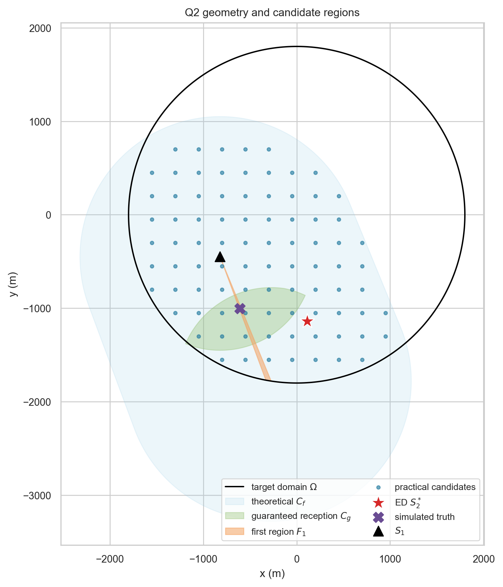
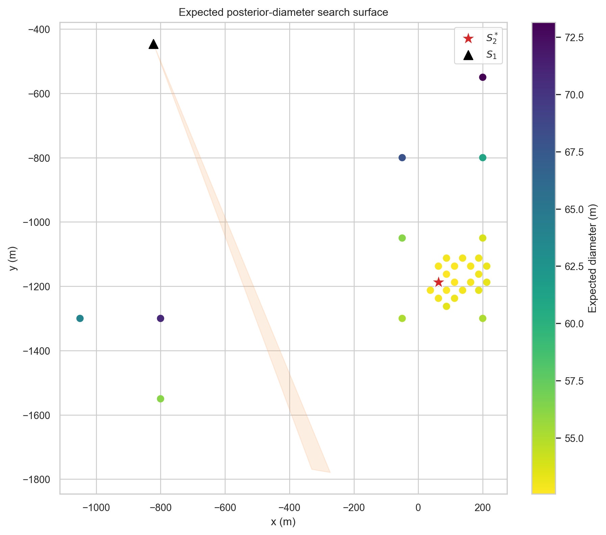
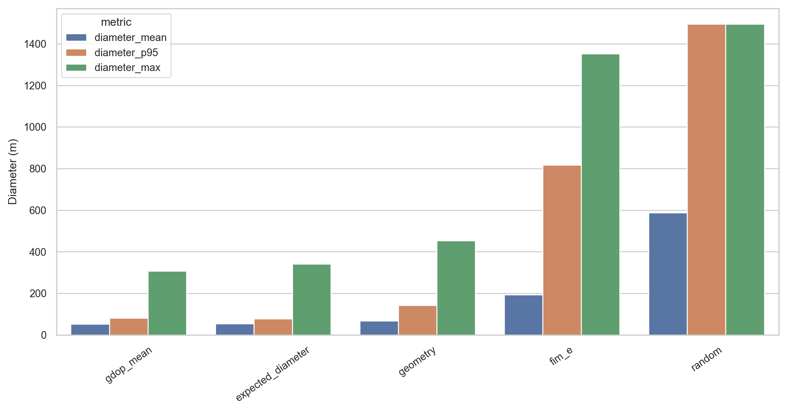
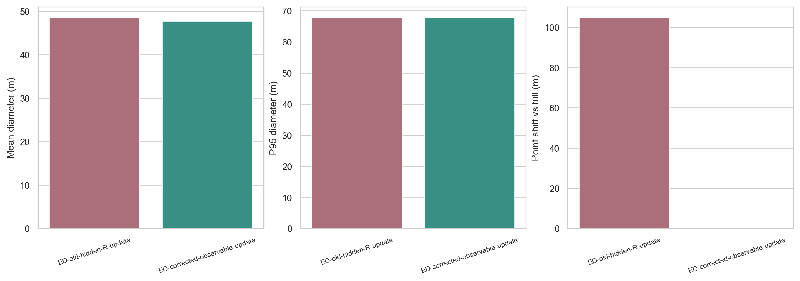
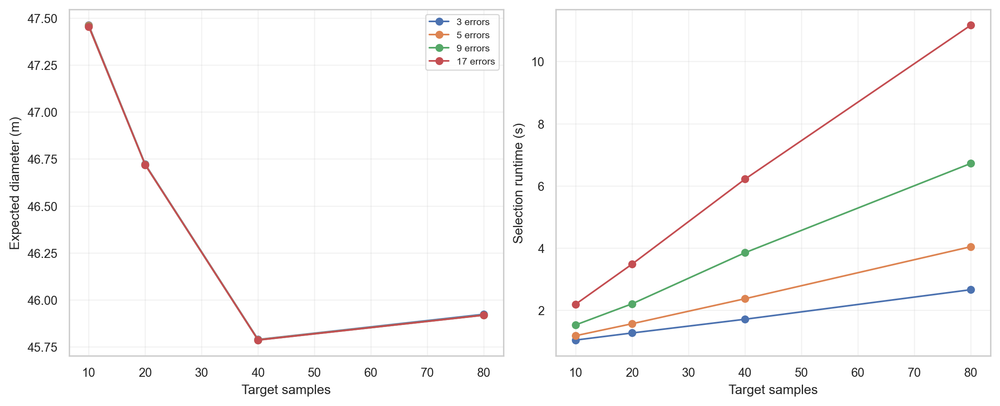
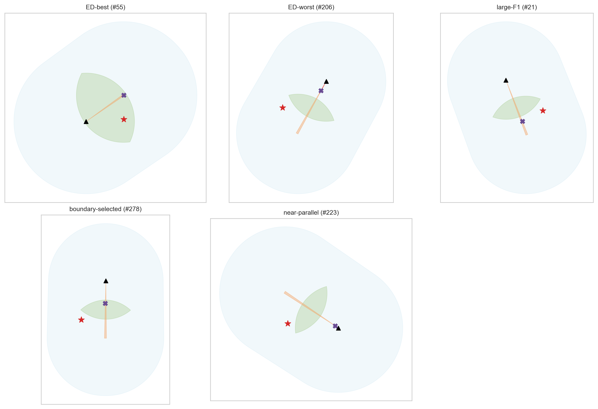

# 问题 2 报告：全向干扰源第二检测点选择

## 摘要

本文在题面给出的 **±1° 硬误差界** 下，以集合交会而非概率椭圆定义定位区域，比较 Expected Diameter、Geometry、GDOP Mean、FIM E-optimal 与 Random 五类核心策略。为避免概念混淆，依次定义第一次观测后的目标可能区域 \(\mathcal F_1\)、第二点理论可行域 \(\mathcal C_f\)、保证接收域 \(\mathcal C_g\)、实际搜索域和策略最终点 \(S_2^*\)。

正式实验包含 400 个基础几何状态，每个状态复现 25 次第二观测，共 10,000 个有效观测场景和 50,000 条策略评价。所有确定性策略共享 250 m → 100 m → 50 m 粗到细搜索。最终 GDOP Mean 与 Expected Diameter 的平均定位直径分别为 52.38 m 与 53.32 m；Expected Diameter 相对 GDOP Mean 的配对均值差为 -0.95 m，95% 场景聚类 bootstrap 置信区间为 [-2.26, 0.13] m，尚不能判定存在显著差异。Expected Diameter 的 P90/P95 更小，GDOP Mean 的均值、中位数、最大值和计算时间更优。因此本文把 Expected Diameter 作为与题面指标直接一致的主模型，同时把 GDOP Mean 列为高效竞争方案，不声称前者全面占优。

## 1. 问题分析与证据边界

全文使用以下证据标签：

- **[题面]**：题目或附件明确给出的条件；
- **[假设]**：为形成概率型选点模型而增加的假设；
- **[推导]**：由题面与模型推出的结论；
- **[实验]**：仅由本次固定配置仿真支持的观察。

**[题面]** 目标区域为半径 1800 m 的圆；全向干扰源有效接收半径 \(R\in[1000,1500]\) m；正常示向误差满足 \(|e|\le1^\circ\)；距离不超过 5 m 时无示向度但可直接光学定位；机器狗速度为 5 m/s。

**[推导]** 一次正常示向将二维目标圆缩成窄扇环。第二点既要提高获得有效观测的机会，又要与第一次视线形成非退化交会角。只追求 90°、近距离、接收率或短移动均可能牺牲其他指标，需在统一观测更新和统一评价器下比较。

## 2. 区域与观测更新

记 \(\Omega=B((0,0),1800)\)，目标真实位置为 \(G\)，检测点为 \(S_i\)，示向误差上界为 \(\delta=1^\circ\)。定义

\[
W(S,\theta;r_-,r_+)=\{g:r_-<\|g-S\|\le r_+,\ |
\operatorname{adiff}(\beta(S,g),\theta)|\le\delta\}.
\]

第一次返回正常示向后，未知个体接收半径不能当作已知量代入。保证包含真值的区域为

\[
\boxed{\mathcal F_1=\Omega\cap W(S_1,\theta_1;5,1500)}.
\]

第二次观测统一按以下硬集合更新：

\[
\mathcal F_2=
\begin{cases}
\mathcal F_1\cap W(S_2,\theta_2;5,1500),&\text{bearing},\\
\mathcal F_1\setminus B(S_2,1000),&\text{no signal},\\
\{G\},\ D(\mathcal F_2)=0,&\text{near}.
\end{cases}
\]

这修复了原实现将仿真中的隐藏真实半径 \(R\) 泄露给定位更新的问题。真实 \(R\) 只用于生成观测结果，不再用于 bearing 扇区截断；无信号也只能推出距离大于题面保证半径 1000 m。旧的 hidden-\(R\) 更新仅保留为消融选项。

定位区域直径定义为 \(D(A)=\max_{p,q\in A}\|p-q\|\)，实现中由集合凸包顶点最远点对计算。

## 3. 第二检测点区域

理论上，只要某个第一次可行目标在最大接收半径内，第二点就可能收到信号：

\[
\mathcal C_f^{\rm theory}=\{s:\min_{g\in\mathcal F_1}\|s-g\|\le1500\}
=\mathcal F_1\oplus B(0,1500).
\]

能够对所有第一次可行目标保证接收的区域为

\[
\mathcal C_g=\{s:\max_{g\in\mathcal F_1}\|s-g\|\le1000\}.
\]

**[假设]** 主实验将行动点限制在目标圆 \(\Omega\) 内，并在 \(\Omega\cap\mathcal C_f^{\rm theory}\) 上搜索。默认只删除不可能接收的点，不再用任意的 \(p_{\rm det}\) 或交会角阈值硬剪枝；这些阈值只作为消融参数。圆外候选域已单独做敏感性检查。

**[假设]** 概率型目标使用 \(\mathcal F_1\) 内均匀面积先验，并令

\[
R\mid G,Y_1\sim U(\max\{1000,\|G-S_1\|\},1500).
\]

该先验只影响行动排序，不改变上述硬集合更新或覆盖保证。主配置用 80 个后验目标粒子近似。

## 4. 五种核心策略与公平搜索

### 4.1 Expected Diameter

主策略直接最小化下一次观测后的期望集合直径：

\[
S_2^*=\arg\min_{s\in\mathcal C}
E[D(\mathcal F_2(Y_1,Y_2(s);s))\mid Y_1].
\]

每个精确候选使用全部 80 个目标粒子和 5 个 \([-1^\circ,1^\circ]\) 等权中点误差节点，通过真实几何集合计算目标值。粗到细流程为：250 m 全域代理筛选，保留 10 个精确候选；围绕最优的 3 个种子分别以 100 m、50 m 网格细化。典型场景累计 12,000 次精确“目标粒子×误差节点”集合评价，并记录每层候选数、精确评价数和目标值。

### 4.2 Geometry

几何策略最大化接收加权的交会质量：

\[
U_{\rm geo}(s)=E\left[\mathbf1_{\{\|G-s\|\le R\}}
\frac{|\sin\alpha|}{\sqrt{\|G-S_1\|\,\|G-s\|}}\right].
\]

它同时考虑交会角、两段距离和接收概率。

### 4.3 GDOP Mean

方位观测 Jacobian 为

\[
h(S,G)=\frac{1}{\|G-S\|^2}[-(G_y-S_y),\ G_x-S_x],
\]

令 \(J=\sum_i h_i^Th_i/\sigma^2\)，最小化后验粒子上的 \(E[\sqrt{\operatorname{tr}(J^{-1})}]\)。这只是选点代理，最终仍由硬集合直径评价。

### 4.4 FIM E-optimal

最大化后验粒子上的最小信息特征值 \(E[\lambda_{\min}(J)]\)。其中 \(\sigma=\delta/\sqrt3\) 是与均匀有界误差同方差的高斯代理，不替代 ±1° 硬边界。

### 4.5 Random

在与确定性策略相同的基础搜索域中按固定种子随机抽点，作为下限基线。

为避免网格精度成为策略间混杂因素，Geometry、GDOP Mean、FIM E-optimal 与 Expected Diameter 全部共享 250 m → 100 m → 50 m 粗到细搜索；Random 共享域但不做优化。

## 5. 实验设计与验证

### 5.1 正式实验

真值在目标圆内按面积均匀生成，\(S_1\) 通过拒绝采样形成合法第一次 bearing。真实半径覆盖固定 1000、1250、1500 m 与 \([1000,1500]\) 均匀随机四种模式；误差覆盖均匀、截断高斯和有界端点三种形态。它们是覆盖性实验设计，不代表题面给出了对应概率频率。

固定主种子为 20260911。400 个基础状态各复现 25 次第二观测，共 10,000 个观测场景。五种策略共享场景、第一次读数、候选域、第二误差和评价器。记录直径/面积的 mean、median、P75/P90/P95/P99/max，bearing/near/no-signal 比例，移动距离/时间，候选数、精确评价数和选点耗时。

成对差值按相同 `scenario_id, replicate` 计算；95% CI 对 400 个基础场景作 cluster bootstrap，避免把同一几何的 25 次误差当成完全独立样本。运行清单记录配置、种子、Git 版本、Python/依赖版本、开始时间和总耗时。

### 5.2 正确性测试

13 个测试全部通过，覆盖：正交优于近平行、镜像一致、圆边界/接收边界/5 m 内孔、窄扇区采样、圆弧离散收敛、粗到细搜索可行性、策略返回有限点、已知 Monte Carlo 统计量，以及本次新增的三类观测公共更新回归测试。特别验证：bearing 更新不读取隐藏 \(R\)，no-signal 只删除 1000 m 圆盘，near 的面积和直径均为零。

## 6. 正式实验结果

| 策略 | mean D/m | median | P90 | P95 | max | no signal | 平均移动/m | 选点耗时中位数/s |
|---|---:|---:|---:|---:|---:|---:|---:|---:|
| GDOP Mean | **52.38** | **47.54** | 71.66 | 81.12 | **306.71** | 2.25% | 1027.03 | 0.624 |
| Expected Diameter | 53.32 | 47.64 | **68.63** | **78.73** | 341.17 | 2.50% | 1047.28 | 3.026 |
| Geometry | 67.67 | 56.27 | 120.21 | 142.46 | 453.83 | **0%** | 920.39 | **0.015** |
| FIM E-optimal | 193.41 | 66.42 | 609.44 | 817.15 | 1352.20 | **0%** | **389.17** | 0.637 |
| Random | 588.04 | 278.29 | 1495.00 | 1495.00 | 1495.00 | 45.00% | 1208.11 | 0.002 |

### 6.1 Expected Diameter 的配对比较

以“对方直径减 Expected Diameter 直径”为正向提升：

| 对比策略 | 平均提升/m | 中位提升/m | 95% cluster-bootstrap CI/m | 胜/平/负 |
|---|---:|---:|---:|---:|
| FIM E-optimal | 140.09 | 28.68 | [114.08, 166.62] | 62.05% / 0% / 37.95% |
| GDOP Mean | -0.95 | 0.00 | [-2.26, 0.13] | 41.86% / 19.00% / 39.14% |
| Geometry | 14.34 | 6.88 | [9.88, 18.69] | 66.21% / 0% / 33.79% |
| Random | 534.71 | 241.65 | [481.34, 588.94] | 84.46% / 0% / 15.54% |

Expected Diameter 显著优于 Geometry、FIM E-optimal 和 Random；与 GDOP Mean 的差异较小且置信区间跨零。它的 P90/P95 更好，GDOP Mean 则在中心趋势、最坏样本和速度上更好。

### 6.2 行动和计算代价

Expected Diameter 的正常选点耗时中位数为 3.026 s、P95 为 4.054 s；原始数据中有一次 1973 s 的外部暂停/进程挂起异常，使其均值失真，因此不以均值代表正常计算成本。GDOP Mean 的中位数和 P95 分别为 0.624 s、0.764 s。Geometry 最快且少移动约 127 m，但平均直径比 Expected Diameter 大 14.34 m。FIM E-optimal 移动最少，却出现很大的定位尾部。

## 7. 消融、敏感性与收敛

### 7.1 隐藏半径修复

在 12 个配对状态的 80×5 配置下，公共保守更新的实现后 mean D 为 47.79 m，旧 hidden-\(R\) 更新为 48.63 m，选点平均移动 104.94 m。该结果说明泄露隐藏半径会实质改变策略，而不是证明某种先验普遍更优。

### 7.2 网格与采样

- 仅用 250 m 粗网格时 mean D 为 48.61 m，粗到细为 47.79 m；两者选点平均相差 293.28 m，耗时约 1.23 s 与 3.84 s。
- 在 6 个状态上，80×5 与更高误差节点数 80×17 选点和结果一致，耗时约 4.05 s 与 11.16 s。
- 单层 100 m 网格与粗到细搜索的选点平均相差 45.56 m，后者期望目标值略低。

### 7.3 先验、误差和候选域

12 状态小样本中，不同半径先验的 realized mean D 为 46.94–48.66 m，选点平均移动 15–41 m；三种规划误差模型在该组状态上给出相同选点；允许圆外理论候选域没有改变选点或结果，只增加候选数和耗时。旧的 0.25 接收概率剪枝与关闭该阈值时选点一致，同时平均候选数由 279.3 降为 244.4；为避免把经验阈值伪装成题面约束，正式主配置仍采用 `reachable_only`。以上均是小样本稳健性检查，不作“完全不敏感”的外推。

## 8. 结论与推荐

**[实验结论]** 若评价目标严格采用题目的“下一次定位区域直径”，推荐 Expected Diameter：它直接优化该指标，P90/P95 最优，并通过公共保守更新避免了隐藏半径泄露。若实时计算预算更紧，GDOP Mean 是本次实验中更合适的工程方案：平均表现与 Expected Diameter 无显著差异，正常耗时约快 5 倍，且样本最大值更小。

实际流程建议为：

1. 由第一次 bearing 构造 \(\mathcal F_1\)，在 \(\Omega\cap\mathcal C_f^{\rm theory}\) 上生成候选点；
2. 使用 250 m → 100 m → 50 m 粗到细搜索，优先运行 Expected Diameter，实时预算不足时切换 GDOP Mean；
3. 第二次 bearing 使用 1500 m 可观测上界更新；no-signal 仅删除 1000 m 圆盘；near 直接令定位直径为零；
4. 将移动时间与多源清除调度留给问题 3，不在本任务中修改 Q3 模型。

## 9. 优点与局限

优点：硬误差用集合保证处理；概率先验只用于动作排序；三类观测共享同一更新；确定性策略共享搜索精度；结果、配置、清单、统计、消融和图表均可复现。

局限：题面未给出真实位置、半径和误差概率分布，概率型目标依赖明确但不可由题面验证的先验；粗到细离散搜索不是连续域全局最优证明；消融/敏感性多采用 12 个状态、采样收敛采用 6 个状态，只能发现明显不稳健性；正式运行含一次外部暂停造成的耗时离群点；主样本没有观察到 near，不能据此估计 near 的真实频率；圆外候选域只做了有限小样本检查。

## 10. 可复现文件

- 主实现：`src/geometry/`、`src/localization/update.py`、`src/strategies/selectors.py`；
- 正式实验：`experiments/run_benchmark.py`；
- 消融与敏感性：`experiments/run_studies.py`；
- 汇总与作图：`experiments/analyze_results.py`、`experiments/make_figures.py`；
- 一键流程：`experiments/run_all.py`；
- 原始数据与清单：`results/raw/`；
- 汇总表：`results/tables/`；代表案例：`results/case_studies/`；
- PNG/PDF 图：`results/figures/`；
- 测试：`tests/`；命令说明：`README.md`；字段说明：`report/data_dictionary.md`。
