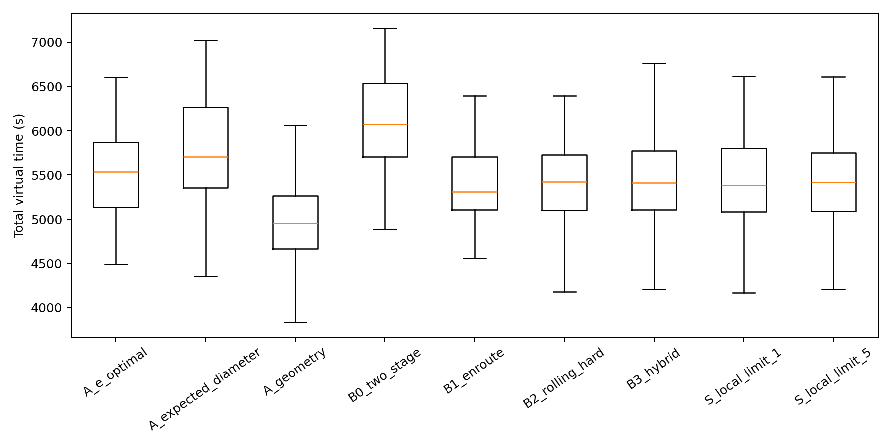
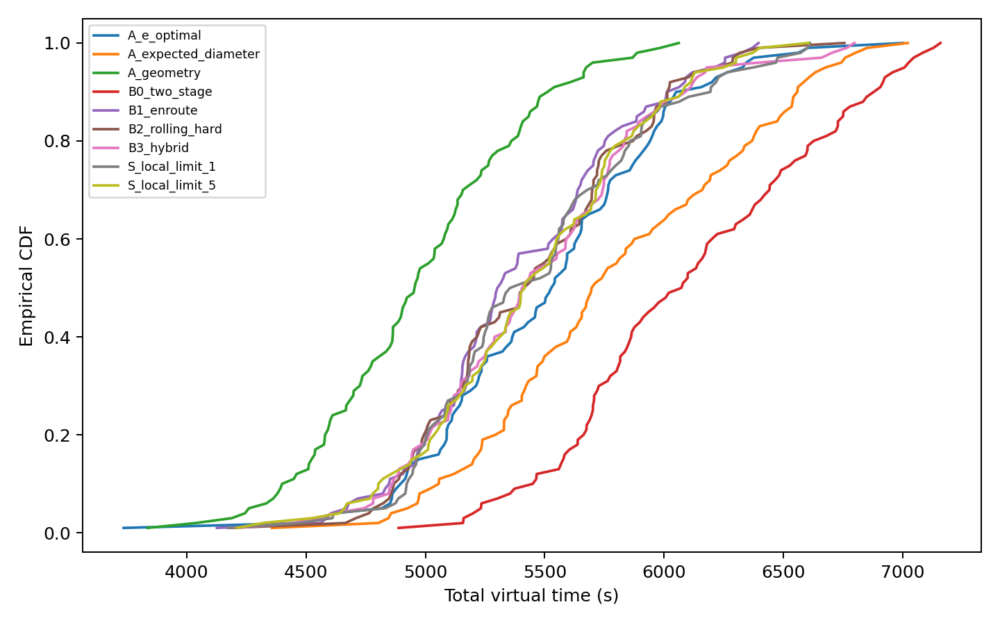

# B 题问题 3：未知全向干扰源的自动搜索、定位与清除

## 摘要

针对目标数未知、频道互异、示向误差有界且接收半径未知的问题，本文提出“确定性保证层 + 期望时间加速层”。保证层以原点和半径 1200 m 正六边形六顶点构成七点搜索骨架，为每个频道维护连续可行集的方格外包，并根据 `direction`、`no_signal` 与 `near` 作包含真值的集合更新。仅当外包集合最小包围圆半径不超过 $19.75$ m 时在圆心清除；否则至多追加 6 次正常示向，随后以 20 m 圆盘有限覆盖作为必清除兜底。加速层在 SEARCH、LOCALIZE、CLEAR 候选间滚动比较移动、切频、检测、清除、剩余骨架和尾部风险，并以连续 3 个局部动作作为防饿死阈值。概率粒子只改变候选顺序，不参与集合删除、清除认证或终止。

在固定种子 20260911 的 100 个配对离线案例中，9 个配置共 900 次运行全部实现 100% 清除。无粒子硬滚动和粒子混合相对固定两阶段平均节省 668.6 s 和 646.5 s，按案例 bootstrap 95% 区间分别为 $[603.6,735.2]$ s 与 $[581.2,715.9]$ s。局部消融中 geometry 的平均总时间 4973.8 s 最短，说明本实验中的粒子重排没有战胜简单几何排序。详细统计由 `task3/results/raw/offline_runs.jsonl.gz` 可复现生成，见第 9 节。四次官方模拟器演练均完成七点覆盖和全部清除，平均定位清除时间分别为368.995、357.286、334.597和434.014 s/个；各局目标配置不同，不能据此作配对因果比较，也不伪造尚未取得的正式测试结果。

## 1. 问题分析与证据边界

题面给定目标区域

$$
\Omega=B((0,0),1800),
$$

全向源数为 10--16，频道在 1--20 中互不相同。每个源的有效接收半径 $R_c\in[1000,1500]$ m；正常示向误差不超过 $1^\circ$；距离不超过 5 m 时返回 `near`；清除半径为 20 m。机器狗速度为 5 m/s；检测、任意频道切换、光学定位和激光清除分别耗时 5、1、3、2 s。

本文区分三类结论：

- 题面和附件直接规定物理范围、时间和 HTTP 行为；
- 七点覆盖、集合包含、MEC 清除与有限圆盘覆盖是从硬边界推导的确定性结论；
- 候选排序、粒子先验和策略优劣仅由指定离线或官方演练样本支持。

因此，本文证明有限步发现和清除，不声称任意场景下总时间全局最短；离线 mock 结果也不代替官方模拟器演练。

## 2. 七点覆盖与执行时序

### 2.1 覆盖布局和解析证书

取

$$
P_0=(0,0),\qquad
P_{k+1}=1200(\cos(\theta_0+k\pi/3),\sin(\theta_0+k\pi/3)),
\quad k=0,\ldots,5.
$$

利用六重对称，只需考察一个 $60^\circ$ 扇区。原点与外圈点的 Voronoi 交点最远距离为

$$
d_v=\frac{1200}{2\cos30^\circ}=692.8203\ \mathrm{m}.
$$

目标圆周在相邻外圈点角平分线处的最近距离为

$$
d_b=\sqrt{1800^2+1200^2-2\cdot1800\cdot1200\cos30^\circ}
=968.9016\ \mathrm{m}.
$$

故

$$
\max_{x\in\Omega}\min_{0\le i\le6}\lVert x-P_i\rVert
=\max(d_v,d_b)=968.9016<1000,
$$

最小覆盖裕量为 31.0984 m。于是每个未清除全向源至少在一个覆盖点必被接收。密集采样测试只作交叉检查，严格结论来自上述解析界。

从原点依相邻外圈顶点访问且不回原点，骨架长度为

$$
L_7=1200+5\times1200=7200\ \mathrm{m},
$$

移动时间 1440 s。若七点均扫描 20 个频道，检测时间 700 s，同一点内 19 次切频使总切频时间为 133 s，保守骨架合计 2273 s。

### 2.2 不破坏证明的滚动执行

`/enter` 后立即在原点扫描，初始频道 1 第一个检测。原点读数只用于在 12 个旋转角和两个遍历方向中选择有利交会几何；旋转不改变覆盖证书。其余覆盖点不可取消，但相邻点之间可插入局部定位或清除。默认连续局部动作上限为 3，达到上限后强制执行下一个 SEARCH。除非已成功清除 16 个，否则退出前必须完成所有仍未知频道的七点检测。

同一点批量扫描先测当前频道，并可把下一动作需要的频道放在末尾。任意两个不同频道切换均为 1 s，与频道编号之差无关，因此没有按频道编号求旅行商问题。

## 3. 分频道状态机

对 $c=1,\ldots,20$ 维护

$$
X_c=(e_c,U_c,F_c,H_c,C_c),
$$

其中 $e_c\in\{\text{unknown},\text{found},\text{cleared},\text{absent}\}$，$U_c$ 为未发现时的可能位置，$F_c$ 为发现后的硬可行集，$H_c$ 为全部观测历史，$C_c$ 为已经完成的覆盖点索引。频道本身就是目标身份，不引入匿名数据关联。

合法转移仅为

```text
unknown --direction/near--> found --clear success--> cleared
unknown --seven certified no-signal coverage points--> absent
```

同频道同位置不会重复检测，网络超时的幂等重试不视为新测量。`near` 后立即在当前位置 `/clear`；若清除异常失败，频道仍保持 `found`。

## 4. 三类观测与硬集合更新

### 4.1 正常示向

检测点 $s$ 返回 $\hat\theta$ 时，连续硬约束为

$$
W(s,\hat\theta)=\left\{x\in\Omega:
5<\lVert x-s\rVert\le1500,
\left|\operatorname{adiff}(\arg(x-s),\hat\theta)\right|\le1^\circ
\right\}.
$$

首次发现时 $F_c=U_c\cap W$，之后 $F_c\leftarrow F_c\cap W$。

### 4.2 无信号

问题 3 只有全向源，且 $R_c\ge1000$ m，因此

$$
\texttt{no\_signal}\Longrightarrow x_c\notin B(s,1000).
$$

未知频道更新 $U_c\leftarrow U_c\setminus B(s,1000)$，已发现频道更新 $F_c\leftarrow F_c\setminus B(s,1000)$。程序从不因一次无信号删除 1500 m 圆。

### 4.3 近距离

`near` 给出 $\lVert x_c-s\rVert\le5$ m，因此在 $s$ 清除必满足 20 m 半径。程序在读取 `near` 的下一动作立即清除，不等待调度器重新排序。

## 5. 连续集合的安全数值外包

为避免 Shapely 内接圆多边形删除真值，程序用边长 $h=20$ m 的闭方格并集表示外包。初始保留所有与 $\Omega$ 相交的格。格中心为 $z$，半边长 $a=h/2$，半对角线

$$
\rho=\frac{h}{\sqrt2}=14.1421\ \mathrm{m}.
$$

对点 $s$，点到方格的最小和最大距离均有解析式。`no_signal` 仅当整格满足最大距离 $d_{\max}(s,Q)\le1000$ 时删除。示向更新把方格包含在半径 $\rho$ 的外接圆内；当 $d=\lVert z-s\rVert>\rho$ 时，方格可能方位相对中心方位的偏移不超过

$$
\alpha_Q=\arcsin(\rho/d).
$$

只有中心角区间与 $\hat\theta\pm(1^\circ+\varepsilon_\theta)$ 不相交，或整格不可能满足 $5<r\le1500$ 时才删除。每个单独判据都是“证明整格不可能”才删除，故保留格并集是连续交集的外包；判据之间不要求同一格内见证点相同，这只会扩大集合。

若已发现频道的一次合法更新意外得到空集，程序保留上一次非空硬集并记录诊断，不退化为点估计。认证清除意外失败时，保留完整观测历史，把角容差扩大至少 $10^{-5}$ 度后重建外包，再返回定位或兜底。

## 6. 局部候选和滚动时间目标

每个 `found` 频道生成以下有限候选：MEC 圆心、凸包 Chebyshev 中心、质心、代表性边界点、与第一视线近似正交的两点、候选环点、尚未访问的覆盖点，以及 task2 的 geometry、E-optimal 和 expected-diameter 三类优胜点。

对于候选 $s$，先检验

$$
\max_{x\in F_c}\lVert x-s\rVert\le1000.
$$

实现对外包所有格角点取最大值；若存在满足式子的候选，短名单只保留保证接收点。若不存在，评分显式加入最坏 `no_signal` 分支。E-optimal 用方位 Jacobian 信息阵最小特征值排序；expected-diameter 用有界交会宽度和硬集合尺度作短名单代理。FIM 和粒子都只用于排序，不声称给出 $\pm1^\circ$ 的包含保证。

调度动作集合为

$$
\mathcal A=\{\text{SEARCH},\text{LOCALIZE},\text{CLEAR}\}.
$$

评分形式为

$$
J(a)=T_{\mathrm{move}}+T_{\mathrm{switch}}+T_{\mathrm{action}}
+\widehat T_{\mathrm{skeleton}}+\widehat T_{\mathrm{found}}
+\lambda R_{0.9}.
$$

$T_{\mathrm{action}}$ 对检测取 5 s，对成功清除取 $3+2=5$ s；剩余项包含未知频道扫描、剩余覆盖路线、已发现源的追加测量与清除、清除点相对下一骨架点的插入距离。混合策略以 80 个确定种子位置/接收半径粒子估计均值和 P90，$\lambda=0.20$。无粒子硬滚动消融改用支持点上的最坏分支，不使用概率均值。

## 7. MEC 清除条件与有限覆盖兜底

对所有保留格的四角点求最小包围圆 $(q_c,r_c)$。圆盘是凸集；若圆包含一个方格四角，就包含整个方格。因此该圆包含非凸保留格并集。程序复核所有角点距离并向外增加 $10^{-8}$ m 数值量，仅当

$$
r_c\le20-0.25=19.75\ \mathrm{m}
$$

时在 $q_c$ 认证清除。一般集合的“直径不超过 40 m”不能推出半径 20 m 圆覆盖；例如边长 40 m 的正三角形直径为 40 m，而外接圆半径为 $40/\sqrt3>20$ m。

若正常示向累计达到 6 次仍无认证圆，程序对每个保留格使用其中心作为清除点。由于

$$
\max_{x\in Q}\lVert x-z_Q\rVert=\frac{20}{\sqrt2}<20,
$$

这些圆无缝覆盖整个外包集合。最近邻依次访问，首次成功即停止。真实位置始终属于至少一个保留格，故有限队列中至少一个清除点成功。失败点只删除被 20 m 圆完整覆盖的方格，不会删除真值。

## 8. 算法、正确性与复杂度

```text
ENTER; 初始化 20 个 unknown 频道及目标圆外包
在 P0 按 1 优先扫描全部 unknown 频道
由原点示向选择六边形旋转和遍历方向
while 未达到正常终止条件:
    为 found 频道计算 MEC 证书或有限覆盖点
    生成下一 SEARCH、LOCALIZE、CLEAR 候选及预计完成时间
    若连续局部动作达到 L，则强制 SEARCH
    串行发送一个动作；网络重试复用同一 request_id 和请求体
    direction: 方位扇环外包求交
    no_signal: 只删除整格位于 1000 m 圆内的部分
    near: 下一动作立即原地 CLEAR
    clear success: found -> cleared
    certified clear failure: 记录、扩容差、重建并回退
EXIT only if cleared=16, or coverage certificate + no found remains
```

正确性由四个引理组成：正常示向扇环包含真值；全向源无信号安全排除 1000 m 必接收圆；七个必接收圆覆盖 $\Omega$；MEC 或有限圆盘覆盖必有成功清除点。数值实现的方格规则只扩大连续硬集。防饿死阈值使每有限个局部动作后推进覆盖；每个发现频道在至多 6 个正常示向后进入有限清除队列。因此，在题设边界成立且接口持续正常响应时，算法以有限动作发现并清除所有源。

若格数为 $N$、一次更新后凸包角点数为 $H$、候选数为 $K$、排序粒子数为 $M$，一次硬更新为 $O(N)$，MEC 的随机增量期望复杂度为 $O(H)$，候选排序约为 $O(KM)$；内存主要是 20 个布尔掩码，即 $O(20N)$。默认 $h=20$ m 时 $N$ 约为 $\pi1800^2/20^2\approx25447$。

## 9. 离线实验与消融

### 9.1 设计

固定主种子 20260911，随机生成 100 个配对案例。每例源数在 10--16 均匀抽取，频道无放回抽取，位置在目标圆内按面积均匀，接收半径在 $[1000,1500]$ 均匀。误差由场景种子、频道和量化位置的 SHA-256 值确定并限制在硬边界内；同一地点重复测量的误差固定，不错误地重采样。

四种主策略为：B0 完成七点后逐源定位；B1 固定骨架并顺路复测/清除；B2 无概率粒子的硬集合滚动；B3 硬保证加粒子均值/P90 排序。局部消融比较 geometry、E-optimal、expected-diameter 和三类短名单复排；防饿死阈值比较 1、3、5。所有配置共享同一批场景和误差。

### 9.2 可复现结果

离线统计表由以下文件直接生成：

- 原始记录：`task3/results/raw/offline_runs.jsonl.gz`；
- 版本与产物校验：`task3/results/raw/offline_manifest.json`；
- 汇总：`task3/results/tables/offline_strategy_summary.csv`；
- 相对 B0 的配对比较：`task3/results/tables/offline_paired_vs_two_stage.csv`；
- 分布图：`task3/results/figures/offline_virtual_time_boxplot.png` 与 `offline_virtual_time_ecdf.png`。

<!-- OFFLINE_RESULTS_START -->
100 个场景、9 个配置的 900 次运行全部达到 100% 清除，且均完成七点覆盖证书；分析命令检查到的失败数为 0。四种主策略结果如下。

| 主策略 | 清除比例均值 | 总虚拟时间 mean / median (s) | P90 / P95 / max (s) | 平均定位清除时间 (s/个) | 总时间 mean 的 95% CI (s) |
|---|---:|---:|---:|---:|---:|
| B0 固定两阶段 | 1.000 | 6110.3 / 6076.2 | 6881.2 / 7008.6 / 7158.3 | 488.12 | [6006.0, 6216.4] |
| B1 骨架顺路 | 1.000 | 5396.3 / 5309.2 | 6016.7 / 6212.9 / 6396.1 | 431.61 | [5306.8, 5485.8] |
| B2 硬集合滚动 | 1.000 | 5441.7 / 5423.1 | 6014.7 / 6218.8 / 6755.9 | 435.04 | [5354.7, 5529.7] |
| B3 粒子混合 | 1.000 | 5463.8 / 5411.0 | 6091.5 / 6189.4 / 6797.7 | 436.75 | [5373.9, 5563.7] |

配对比较显示，B1、B2、B3 相对 B0 平均分别节省 714.0、668.6、646.5 s，95% CI 分别为 $[642.1,781.9]$、$[603.6,735.2]$、$[581.2,715.9]$ s；逐案例胜率为 96%、98%、95%。这些区间均不含 0，支持“滚动或顺路策略在该离线场景分布中缩短平均时间”，但不构成任意场景的全局最优证明。

局部选点消融结果为：geometry 4973.8 s、E-optimal 5511.0 s、expected-diameter 5792.6 s、三者粒子短名单复排 5463.8 s。geometry 在这批案例中 100/100 次快于 B0，平均节省 1136.5 s，95% CI 为 $[1055.5,1214.0]$ s。粒子复排虽然优于 B0，但没有优于 geometry；原因线索是其平均失败清除次数为 6.48，而 geometry 仅 0.25，且前者移动时间均值 4305.2 s，高于后者的 3883.0 s。该结果提示官方演练应优先比较 `geometry` 与 `shortlist`，不能仅凭复杂度认定粒子策略更优。

防饿死阈值 $L=1,3,5$ 的总时间均值分别为 5459.4、5463.8、5444.5 s，差异相对案例波动很小；三者均 100% 清除且完成覆盖。故保留设计基线 $L=3$ 作为搜索推进与局部插入的中间折中，不声称它在均值上最优。

B3 的平均时间分解为：移动 4305.18 s、切频 161.22 s、检测 914.50 s、光学定位 57.51 s、激光清除 25.38 s，合计 5463.79 s；平均动作数 202.07。平均算法墙钟时间 1.825 s，P95 为 2.411 s，最大 2.486 s。墙钟统计来自 4 进程离线批处理环境，与模拟器正式“程序运行时间”不是同一采集条件。




<!-- OFFLINE_RESULTS_END -->

均值区间按案例 bootstrap 2000 次，避免把同一案例内动作误当作独立样本。正式结论仅限该场景分布、误差构造和固定参数；不外推为全局最优性。

## 10. 官方模拟器演练与正式测试

### 10.1 演练

通过 Windows 到 WSL 的 TCP 转发，程序已连接官方模拟器并完成 4 局问题 3 演练。运行入口为 `task3/experiments/run_practice.py`。演练指标为

$$
\text{清除比例}=\frac{N_{\mathrm{cleared}}}{N_{\mathrm{total}}},\qquad
\text{平均定位清除时间}=\frac{T_{\mathrm{virtual}}}{N_{\mathrm{cleared}}}.
$$

| 案例编码 | 策略 | 真实目标数 | 清除数 | 清除比例 | 总虚拟时间 (s) | 平均定位清除时间 (s/个) | 程序运行时间 (s) | 动作数 | 覆盖点 |
|---|---|---:|---:|---:|---:|---:|---:|---:|---:|
| J2TJ-2H73-YG5X-Y4AZ | B3 hybrid-shortlist | 16 | 16 | 1.000 | 5903.926 | 368.995 | 2.910 | 217 | 7/7 |
| WBBE-W933-ZBEX-DQ7B | hybrid-geometry | 12 | 12 | 1.000 | 4287.436 | 357.286 | 1.867 | 185 | 7/7 |
| GRT8-SCD6-UNQG-528K | champion-000 hybrid-geometry | 14* | 14 | 1.000 | 4684.356 | 334.597 | 2.753 | 188 | 7/7 |
| GKW6-72AQ-J2CJ-DY5A | candidate-020 grid5-center-approach | 11* | 11 | 1.000 | 4774.151 | 434.014 | 6.964 | 177 | 7/7 |

首局 GUI 已交叉确认真实目标数为16。第二局清除12个并将其余8个频道认证为 `absent`，用户确认模拟器正常完成。第三、四局星号表示分别清除14个和11个，并把其余频道认证为 `absent`，仍待GUI真值交叉核对。四局五类虚拟时间分解依次为 $(4680.926,164,940,87,32)$ s、$(3205.436,157,865,36,24)$ s、$(3585.356,159,870,42,28)$ s 和 $(3741.151,148,830,33,22)$ s，分别记录219、187、190和179个接受响应（均含 `/enter` 和 `/exit`），网络重试均为0。

原始脱敏日志位于 `task3/results/raw/practice/`，文件名前缀分别为上述案例编码，汇总为同名 `.summary.json`，聚合表为 `task3/results/tables/practice_summary.csv`。两次稳定 Geometry 演练的平均定位清除时间分别为357.286和334.597 s/个；实验性020策略为434.014 s/个，移动时间达340.105 s/个，但得到4个MEC清除证书且无清除落空。各局源数、位置和误差不同，不能当作同案例配对效应，020仍不满足离线稳定晋级标准。仍建议扩充样本并覆盖网络异常等情况。本节只报告实际取得的数据，不把离线 mock 伪装成官方演练。

### 10.2 正式测试

正式测试三次机会尚未获得本次明确启动授权，代码没有自动正式测试入口。正式测试前须冻结代码和参数，之后不得按单局结果调参；模拟器导出的三份原始加密日志必须保持原文件名和内容。

| 测试案例编码 | 清除干扰源个数 | 平均定位清除时间 | 程序运行时间 | 原始日志位置 |
|---|---:|---:|---:|---|
| 待正式测试授权 |  |  |  |  |
| 待正式测试授权 |  |  |  |  |
| 待正式测试授权 |  |  |  |  |

## 11. HTTP 实现与异常处理

客户端每次只允许一个在途请求；新动作生成新 `request_id`，超时或连接中断重试完全相同的字节和 ID。程序同时检查 HTTP 状态码与 `accepted`，只以最近一次 `accepted=true` 的 `virtual_time_s` 更新时钟。`/clear` 更新位置但不改变当前测向频道。现实截止采用 `/enter` 返回的 `remaining_real_duration_s`，预留 10 s 退出；异常退出在 summary 中标记失败，不能进入有效样本。

原始请求日志逐条落盘，队号在日志和 summary 中均脱敏。服务地址、队号、超时、重试次数、策略和规划参数由命令行传入，不提交凭据或机器状态。

## 12. 优点、局限与改进

主要优点是发现、定位、清除和终止分别有可检查证书；概率模型不会污染硬保证；同一程序可驱动 HTTP 模拟器和离线 mock；全部时间项与动作历史可复核。方格外包也使非凸集合和圆差集无需依赖内接多边形。

局限在于 20 m 方格会保守放大集合，可能比解析曲边集合多做测量或兜底清除；候选评分是一步近似，并非完整 POMDP；粒子先验是排序假设，不是题面真实分布；本地 mock 无法覆盖官方实现的所有网络、调度和隐藏案例行为。可进一步采用自适应四叉树外包以缩小边界膨胀，用区间几何直接求曲边 MEC，并在充分演练数据上只调排序权重而不改变保证层。

## 13. 结论可追溯性

| 结论 | 题面/数据 | 假设或推导 | 实现 | 验证 |
|---|---|---|---|---|
| 所有全向源必被发现 | $R_c\ge1000$, $x_c\in\Omega$ | 七点解析覆盖 | `coverage.py` | 覆盖单测与密集交叉检查 |
| 观测更新不删除真值 | $\pm1^\circ$, 5/1000/1500 m | 方格解析外包 | `geometry.py`, `channel_state.py` | 随机真值包含与跨零度测试 |
| 单点清除有证书 | 清除半径 20 m | 外包角点 MEC | `geometry.py` | MEC 与非凸集合测试 |
| 长期不收敛仍可清除 | 清除半径 20 m | $h/\sqrt2<20$ | `fallback_cover_centers` | 无缝隙测试、端到端随机仿真 |
| 滚动策略缩短时间 | 题目要求时间越短越好 | 配对经验比较 | `scheduler.py` | 离线 bootstrap；官方单局仅作接口验证 |
| 终止不依赖经验阈值 | 总数 10--16 | 上界或覆盖证书 | `termination_status` | 状态机与四策略集成测试 |
